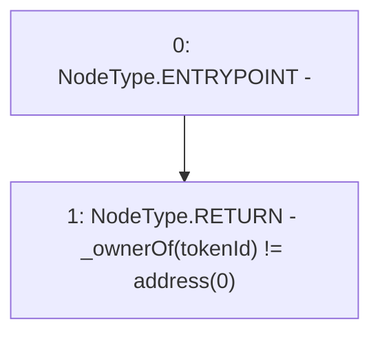

# Context: MochiNFT._exists

**Contract:** `MochiNFT` (Inherits: ERC721Enumerable, IMochiNFT, IERC721Enumerable, ERC721, IERC721Metadata, IERC721, ERC165, IERC165, Context)
**Signature:** `_exists(uint256) returns (bool)`
**Method Selector ID:** `Internal (No Method ID)`
**Visibility:** `internal`
**Environment-Free:** `Yes`
**Modifiers:** None

### State Variables Interaction
- **Reads:** None
- **Writes:** None

### Environment & Verification Flags
- **Uses Foundry Cheatcodes:** No
- **Has Echidna Properties:** No

### Internal Calls Tree
- None

### External Calls / Value Transfers
- None

### Control Flow Graph (CFG)


### Source Mapping
Declared in: `certora-ac-datasets/detasets/web3bugs/dataset/web3bugs/42/projects/mochi-core/node_modules/@openzeppelin/contracts/token/ERC721/ERC721.sol` on lines **210** to **212**

```solidity
    function _exists(uint256 tokenId) internal view virtual returns (bool) {
        return _ownerOf(tokenId) != address(0);
    }

```
