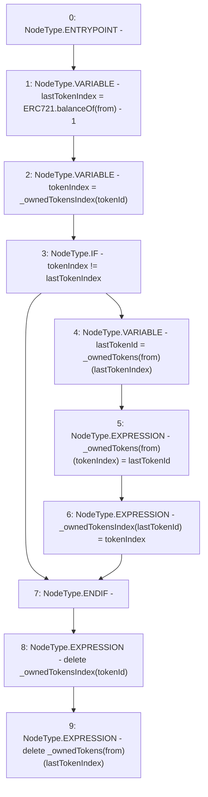

# Context: MochiNFT._removeTokenFromOwnerEnumeration

**Contract:** `MochiNFT` (Inherits: ERC721Enumerable, IMochiNFT, IERC721Enumerable, ERC721, IERC721Metadata, IERC721, ERC165, IERC165, Context)
**Signature:** `_removeTokenFromOwnerEnumeration(address,uint256)`
**Method Selector ID:** `Internal (No Method ID)`
**Visibility:** `private`
**Environment-Free:** `Yes`
**Modifiers:** None

### State Variables Interaction
- **Reads:** _ownedTokens, _ownedTokensIndex
- **Writes:** _ownedTokens, _ownedTokensIndex

### Environment & Verification Flags
- **Uses Foundry Cheatcodes:** No
- **Has Echidna Properties:** No

### Internal Calls Tree
- None

### External Calls / Value Transfers
- None

### Control Flow Graph (CFG)


### Source Mapping
Declared in: `certora-ac-datasets/detasets/web3bugs/dataset/web3bugs/42/projects/mochi-core/node_modules/@openzeppelin/contracts/token/ERC721/extensions/ERC721Enumerable.sol` on lines **115** to **133**

```solidity
    function _removeTokenFromOwnerEnumeration(address from, uint256 tokenId) private {
        // To prevent a gap in from's tokens array, we store the last token in the index of the token to delete, and
        // then delete the last slot (swap and pop).

        uint256 lastTokenIndex = ERC721.balanceOf(from) - 1;
        uint256 tokenIndex = _ownedTokensIndex[tokenId];

        // When the token to delete is the last token, the swap operation is unnecessary
        if (tokenIndex != lastTokenIndex) {
            uint256 lastTokenId = _ownedTokens[from][lastTokenIndex];

            _ownedTokens[from][tokenIndex] = lastTokenId; // Move the last token to the slot of the to-delete token
            _ownedTokensIndex[lastTokenId] = tokenIndex; // Update the moved token's index
        }

        // This also deletes the contents at the last position of the array
        delete _ownedTokensIndex[tokenId];
        delete _ownedTokens[from][lastTokenIndex];
    }

```
