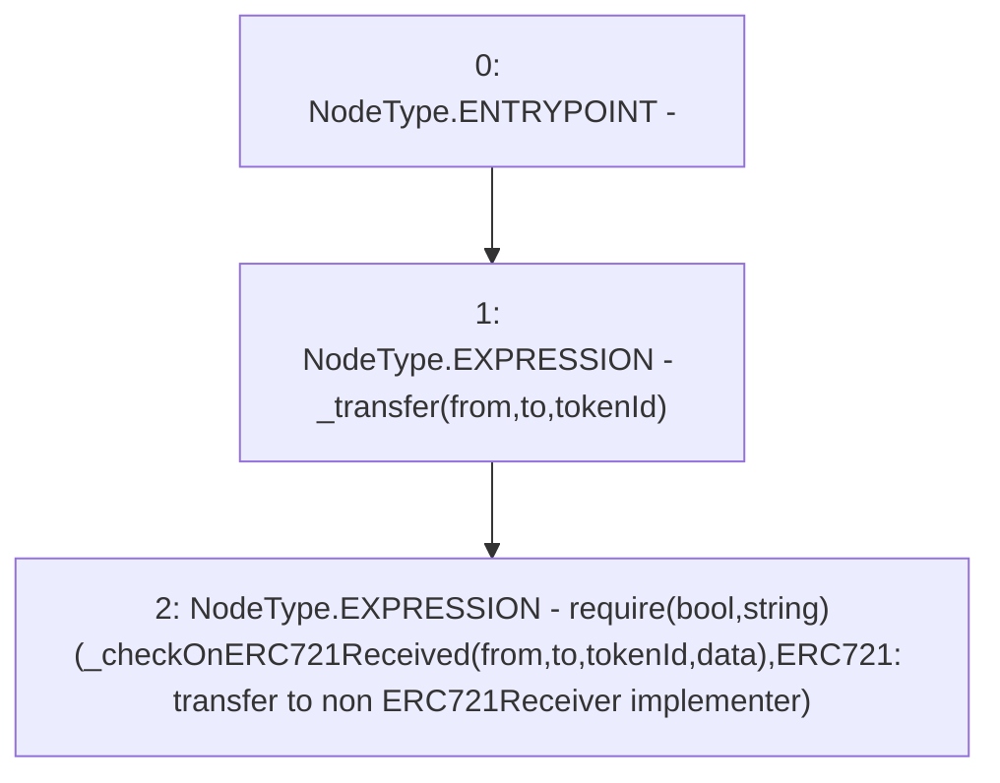

# Context: MochiNFT._safeTransfer

**Contract:** `MochiNFT` (Inherits: ERC721Enumerable, IMochiNFT, IERC721Enumerable, ERC721, IERC721Metadata, IERC721, ERC165, IERC165, Context)
**Signature:** `_safeTransfer(address,address,uint256,bytes)`
**Method Selector ID:** `Internal (No Method ID)`
**Visibility:** `internal`
**Environment-Free:** `No (reads EVM state context)`
**Modifiers:** None

### State Variables Interaction
- **Reads:** None
- **Writes:** None

### Assertion Checks & Business Requirements
- require/assert: `require(bool,string)(_checkOnERC721Received(from,to,tokenId,data),ERC721: transfer to non ERC721Receiver implementer)`

### Environment & Verification Flags
- **Uses Foundry Cheatcodes:** No
- **Has Echidna Properties:** No

### Internal Calls Tree
- None

### External Calls / Value Transfers
- `TMP_78(None) = SOLIDITY_CALL require(bool,string)(TMP_77,ERC721: transfer to non ERC721Receiver implementer)`

### Control Flow Graph (CFG)


### Source Mapping
Declared in: `certora-ac-datasets/detasets/web3bugs/dataset/web3bugs/42/projects/mochi-core/node_modules/@openzeppelin/contracts/token/ERC721/ERC721.sol` on lines **190** to **193**

```solidity
    function _safeTransfer(address from, address to, uint256 tokenId, bytes memory data) internal virtual {
        _transfer(from, to, tokenId);
        require(_checkOnERC721Received(from, to, tokenId, data), "ERC721: transfer to non ERC721Receiver implementer");
    }

```
