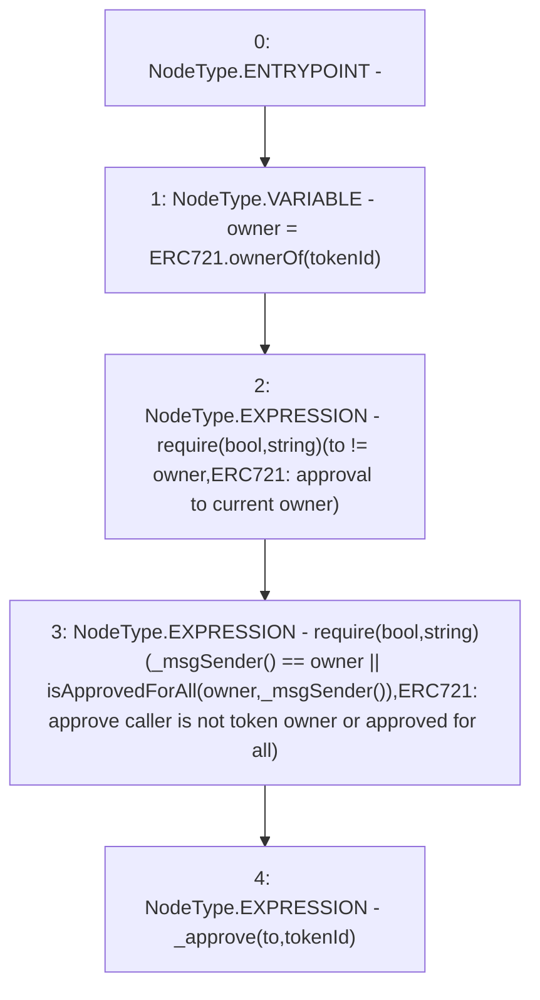

# Context: MochiNFT.approve

**Contract:** `MochiNFT` (Inherits: ERC721Enumerable, IMochiNFT, IERC721Enumerable, ERC721, IERC721Metadata, IERC721, ERC165, IERC165, Context)
**Signature:** `approve(address,uint256)`
**Method Selector ID:** `0x095ea7b3`
**Visibility:** `public`
**Environment-Free:** `No (reads EVM state context)`
**Modifiers:** None

### State Variables Interaction
- **Reads:** None
- **Writes:** None

### Assertion Checks & Business Requirements
- require/assert: `require(bool,string)(to != owner,ERC721: approval to current owner)`
- require/assert: `require(bool,string)(_msgSender() == owner || isApprovedForAll(owner,_msgSender()),ERC721: approve caller is not token owner or approved for all)`

### Environment & Verification Flags
- **Uses Foundry Cheatcodes:** No
- **Has Echidna Properties:** No

### Internal Calls Tree
- None

### External Calls / Value Transfers
- None

### Control Flow Graph (CFG)


### Source Mapping
Declared in: `certora-ac-datasets/detasets/web3bugs/dataset/web3bugs/42/projects/mochi-core/node_modules/@openzeppelin/contracts/token/ERC721/ERC721.sol` on lines **112** to **122**

```solidity
    function approve(address to, uint256 tokenId) public virtual override {
        address owner = ERC721.ownerOf(tokenId);
        require(to != owner, "ERC721: approval to current owner");

        require(
            _msgSender() == owner || isApprovedForAll(owner, _msgSender()),
            "ERC721: approve caller is not token owner or approved for all"
        );

        _approve(to, tokenId);
    }

```
