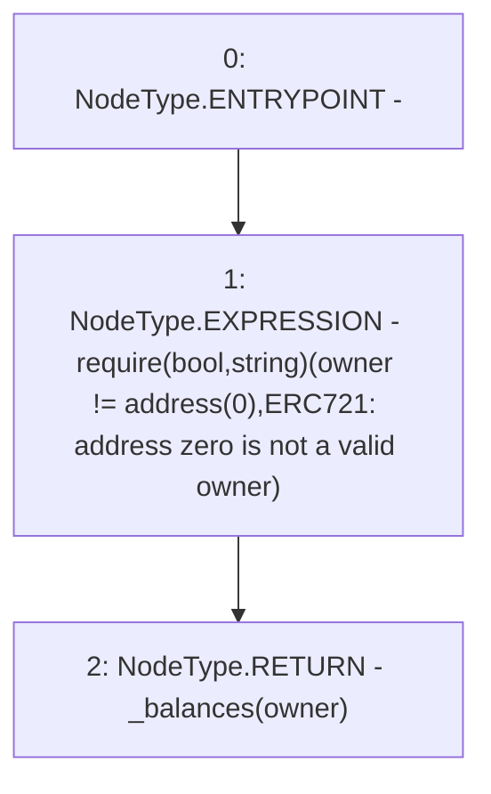

# Context: MochiNFT.balanceOf

**Contract:** `MochiNFT` (Inherits: ERC721Enumerable, IMochiNFT, IERC721Enumerable, ERC721, IERC721Metadata, IERC721, ERC165, IERC165, Context)
**Signature:** `balanceOf(address) returns (uint256)`
**Method Selector ID:** `0x70a08231`
**Visibility:** `public`
**Environment-Free:** `Yes`
**Modifiers:** None

### State Variables Interaction
- **Reads:** _balances
- **Writes:** None

### Assertion Checks & Business Requirements
- require/assert: `require(bool,string)(owner != address(0),ERC721: address zero is not a valid owner)`

### Environment & Verification Flags
- **Uses Foundry Cheatcodes:** No
- **Has Echidna Properties:** No

### Internal Calls Tree
- None

### External Calls / Value Transfers
- None

### Control Flow Graph (CFG)


### Source Mapping
Declared in: `certora-ac-datasets/detasets/web3bugs/dataset/web3bugs/42/projects/mochi-core/node_modules/@openzeppelin/contracts/token/ERC721/ERC721.sol` on lines **62** to **65**

```solidity
    function balanceOf(address owner) public view virtual override returns (uint256) {
        require(owner != address(0), "ERC721: address zero is not a valid owner");
        return _balances[owner];
    }

```
