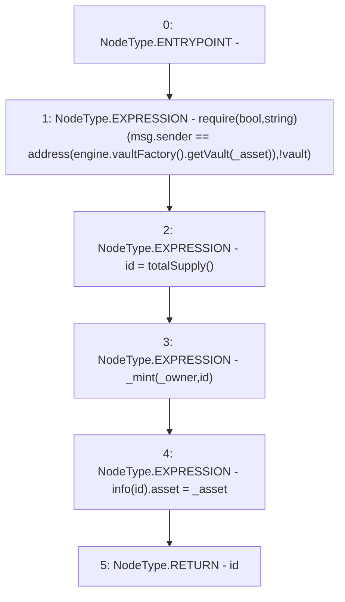

# Context: MochiNFT.mint

**Contract:** `MochiNFT` (Inherits: ERC721Enumerable, IMochiNFT, IERC721Enumerable, ERC721, IERC721Metadata, IERC721, ERC165, IERC165, Context)
**Signature:** `mint(address,address) returns (uint256)`
**Method Selector ID:** `0xee1fe2ad`
**Visibility:** `external`
**Environment-Free:** `No (reads EVM state context)`
**Modifiers:** None

### State Variables Interaction
- **Reads:** engine, info
- **Writes:** info

### Assertion Checks & Business Requirements
- require/assert: `require(bool,string)(msg.sender == address(engine.vaultFactory().getVault(_asset)),!vault)`

### Environment & Verification Flags
- **Uses Foundry Cheatcodes:** No
- **Has Echidna Properties:** No

### Internal Calls Tree
- None

### External Calls / Value Transfers
- `IMochiEngine.TMP_153(IMochiVaultFactory) = HIGH_LEVEL_CALL, dest:engine(IMochiEngine), function:vaultFactory, arguments:[]  `
- `IMochiVaultFactory.TMP_154(IMochiVault) = HIGH_LEVEL_CALL, dest:TMP_153(IMochiVaultFactory), function:getVault, arguments:['_asset']  `

### Control Flow Graph (CFG)


### Source Mapping
Declared in: `certora-ac-datasets/detasets/web3bugs/dataset/web3bugs/42/projects/mochi-core/contracts/vault/MochiNft.sol` on lines **25** to **37**

```solidity
    function mint(address _asset, address _owner)
        external
        override
        returns (uint256 id)
    {
        require(
            msg.sender == address(engine.vaultFactory().getVault(_asset)),
            "!vault"
        );
        id = totalSupply();
        _mint(_owner, id);
        info[id].asset = _asset;
    }

```
