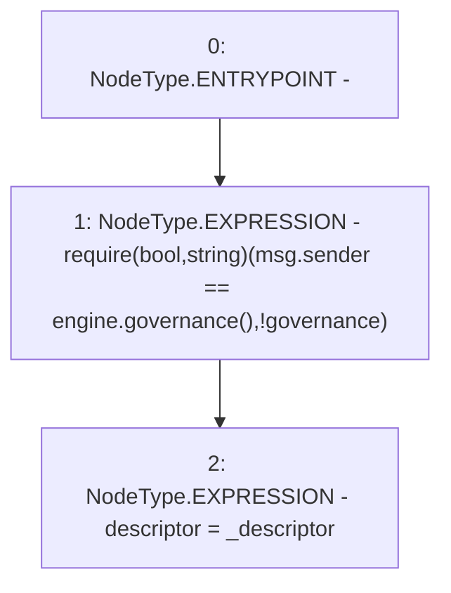

# Context: MochiNFT.setDescriptor

**Contract:** `MochiNFT` (Inherits: ERC721Enumerable, IMochiNFT, IERC721Enumerable, ERC721, IERC721Metadata, IERC721, ERC165, IERC165, Context)
**Signature:** `setDescriptor(address)`
**Method Selector ID:** `0x01b9a397`
**Visibility:** `external`
**Environment-Free:** `No (reads EVM state context)`
**Modifiers:** None

### State Variables Interaction
- **Reads:** engine
- **Writes:** descriptor

### Assertion Checks & Business Requirements
- require/assert: `require(bool,string)(msg.sender == engine.governance(),!governance)`

### Environment & Verification Flags
- **Uses Foundry Cheatcodes:** No
- **Has Echidna Properties:** No

### Internal Calls Tree
- None

### External Calls / Value Transfers
- `IMochiEngine.TMP_150(address) = HIGH_LEVEL_CALL, dest:engine(IMochiEngine), function:governance, arguments:[]  `

### Control Flow Graph (CFG)


### Source Mapping
Declared in: `certora-ac-datasets/detasets/web3bugs/dataset/web3bugs/42/projects/mochi-core/contracts/vault/MochiNft.sol` on lines **20** to **23**

```solidity
    function setDescriptor(address _descriptor) external {
        require(msg.sender == engine.governance(), "!governance");
        descriptor = _descriptor;
    }

```
