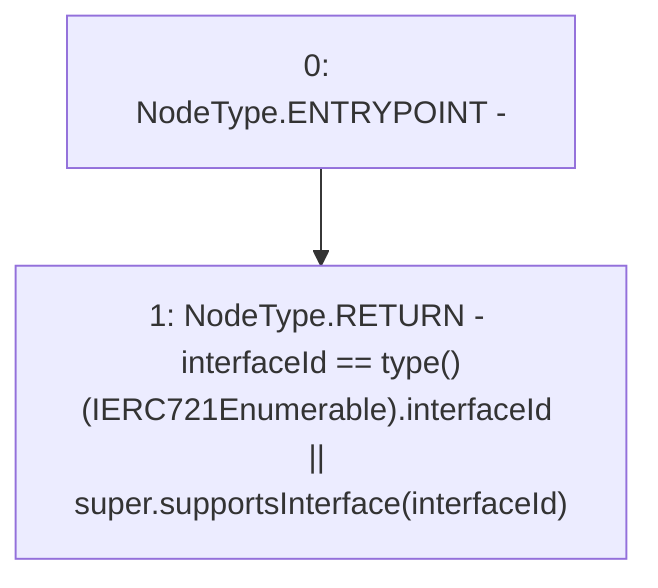

# Context: MochiNFT.supportsInterface

**Contract:** `MochiNFT` (Inherits: ERC721Enumerable, IMochiNFT, IERC721Enumerable, ERC721, IERC721Metadata, IERC721, ERC165, IERC165, Context)
**Signature:** `supportsInterface(bytes4) returns (bool)`
**Method Selector ID:** `0x01ffc9a7`
**Visibility:** `public`
**Environment-Free:** `Yes`
**Modifiers:** None

### State Variables Interaction
- **Reads:** None
- **Writes:** None

### Environment & Verification Flags
- **Uses Foundry Cheatcodes:** No
- **Has Echidna Properties:** No

### Internal Calls Tree
- None

### External Calls / Value Transfers
- None

### Control Flow Graph (CFG)


### Source Mapping
Declared in: `certora-ac-datasets/detasets/web3bugs/dataset/web3bugs/42/projects/mochi-core/node_modules/@openzeppelin/contracts/token/ERC721/extensions/ERC721Enumerable.sol` on lines **30** to **32**

```solidity
    function supportsInterface(bytes4 interfaceId) public view virtual override(IERC165, ERC721) returns (bool) {
        return interfaceId == type(IERC721Enumerable).interfaceId || super.supportsInterface(interfaceId);
    }

```
