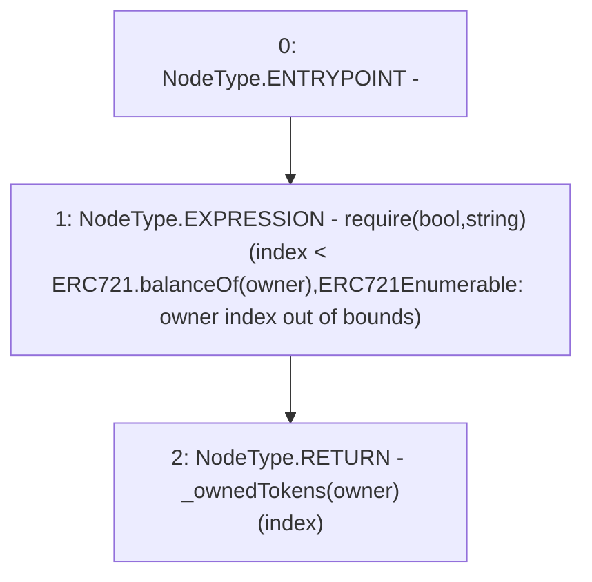

# Context: MochiNFT.tokenOfOwnerByIndex

**Contract:** `MochiNFT` (Inherits: ERC721Enumerable, IMochiNFT, IERC721Enumerable, ERC721, IERC721Metadata, IERC721, ERC165, IERC165, Context)
**Signature:** `tokenOfOwnerByIndex(address,uint256) returns (uint256)`
**Method Selector ID:** `0x2f745c59`
**Visibility:** `public`
**Environment-Free:** `Yes`
**Modifiers:** None

### State Variables Interaction
- **Reads:** _ownedTokens
- **Writes:** None

### Assertion Checks & Business Requirements
- require/assert: `require(bool,string)(index < ERC721.balanceOf(owner),ERC721Enumerable: owner index out of bounds)`

### Environment & Verification Flags
- **Uses Foundry Cheatcodes:** No
- **Has Echidna Properties:** No

### Internal Calls Tree
- None

### External Calls / Value Transfers
- None

### Control Flow Graph (CFG)


### Source Mapping
Declared in: `certora-ac-datasets/detasets/web3bugs/dataset/web3bugs/42/projects/mochi-core/node_modules/@openzeppelin/contracts/token/ERC721/extensions/ERC721Enumerable.sol` on lines **37** to **40**

```solidity
    function tokenOfOwnerByIndex(address owner, uint256 index) public view virtual override returns (uint256) {
        require(index < ERC721.balanceOf(owner), "ERC721Enumerable: owner index out of bounds");
        return _ownedTokens[owner][index];
    }

```
