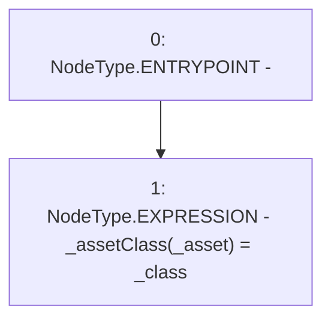

# Context: MochiProfileV0._register

**Contract:** `MochiProfileV0` (Inherits: IMochiProfile)
**Signature:** `_register(address,AssetClass)`
**Method Selector ID:** `Internal (No Method ID)`
**Visibility:** `internal`
**Environment-Free:** `Yes`
**Modifiers:** None

### State Variables Interaction
- **Reads:** None
- **Writes:** _assetClass

### Environment & Verification Flags
- **Uses Foundry Cheatcodes:** No
- **Has Echidna Properties:** No

### Internal Calls Tree
- None

### External Calls / Value Transfers
- None

### Control Flow Graph (CFG)


### Source Mapping
Declared in: `certora-ac-datasets/detasets/web3bugs/dataset/web3bugs/42/projects/mochi-core/contracts/profile/MochiProfileV0.sol` on lines **74** to **76**

```solidity
    function _register(address _asset, AssetClass _class) internal {
        _assetClass[_asset] = _class;
    }

```
