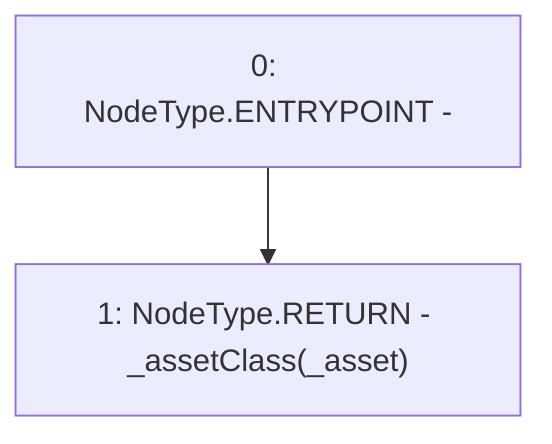

# Context: MochiProfileV0.assetClass

**Contract:** `MochiProfileV0` (Inherits: IMochiProfile)
**Signature:** `assetClass(address) returns (AssetClass)`
**Method Selector ID:** `0xe67f1283`
**Visibility:** `public`
**Environment-Free:** `Yes`
**Modifiers:** None

### State Variables Interaction
- **Reads:** _assetClass
- **Writes:** None

### Environment & Verification Flags
- **Uses Foundry Cheatcodes:** No
- **Has Echidna Properties:** No

### Internal Calls Tree
- None

### External Calls / Value Transfers
- None

### Control Flow Graph (CFG)


### Source Mapping
Declared in: `certora-ac-datasets/detasets/web3bugs/dataset/web3bugs/42/projects/mochi-core/contracts/profile/MochiProfileV0.sol` on lines **41** to **48**

```solidity
    function assetClass(address _asset)
        public
        view
        override
        returns (AssetClass)
    {
        return _assetClass[_asset];
    }

```
