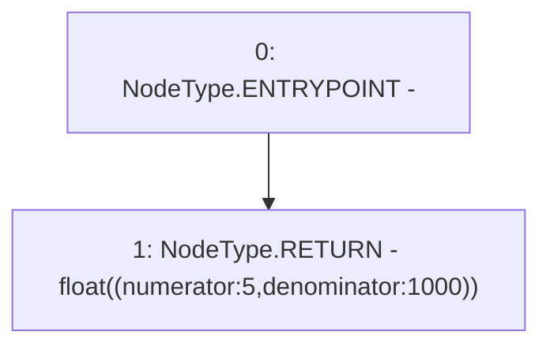

# Context: MochiProfileV0.baseFee

**Contract:** `MochiProfileV0` (Inherits: IMochiProfile)
**Signature:** `baseFee() returns (float)`
**Method Selector ID:** `0x6ef25c3a`
**Visibility:** `public`
**Environment-Free:** `Yes`
**Modifiers:** None

### State Variables Interaction
- **Reads:** None
- **Writes:** None

### Environment & Verification Flags
- **Uses Foundry Cheatcodes:** No
- **Has Echidna Properties:** No

### Internal Calls Tree
- None

### External Calls / Value Transfers
- None

### Control Flow Graph (CFG)


### Source Mapping
Declared in: `certora-ac-datasets/detasets/web3bugs/dataset/web3bugs/42/projects/mochi-core/contracts/profile/MochiProfileV0.sol` on lines **172** to **174**

```solidity
    function baseFee() public pure returns (float memory) {
        return float({numerator: 5, denominator: 1000});
    }

```
