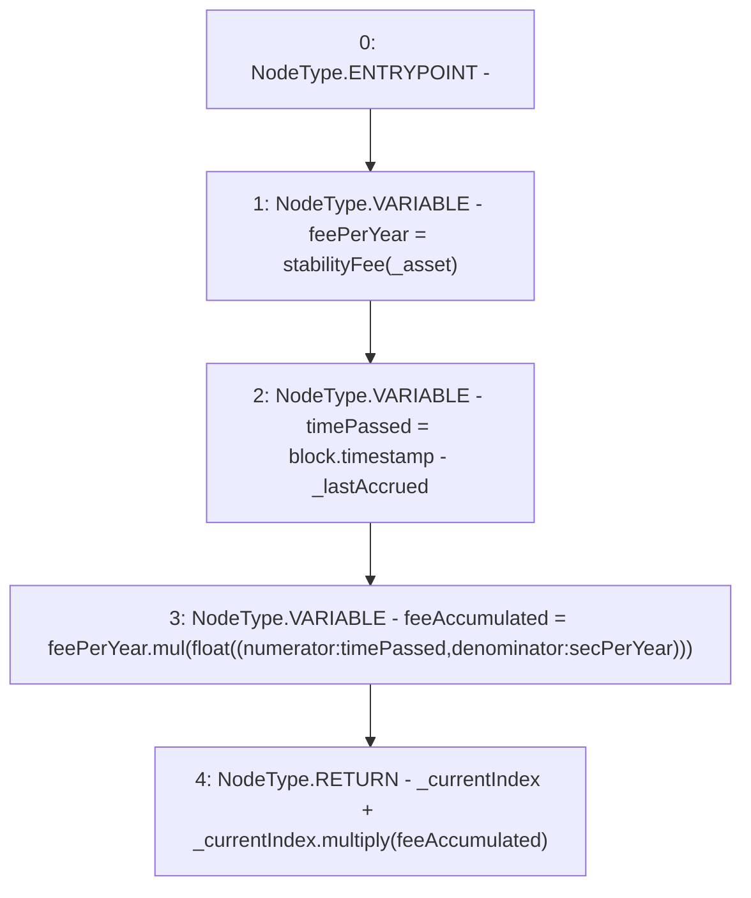

# Context: MochiProfileV0.calculateFeeIndex

**Contract:** `MochiProfileV0` (Inherits: IMochiProfile)
**Signature:** `calculateFeeIndex(address,uint256,uint256) returns (uint256)`
**Method Selector ID:** `0xbded32fe`
**Visibility:** `external`
**Environment-Free:** `No (reads EVM state context)`
**Modifiers:** None

### State Variables Interaction
- **Reads:** secPerYear
- **Writes:** None

### Environment & Verification Flags
- **Uses Foundry Cheatcodes:** No
- **Has Echidna Properties:** No

### Internal Calls Tree
- None

### External Calls / Value Transfers
- `Float.TMP_111(float) = LIBRARY_CALL, dest:Float, function:Float.mul(float,float), arguments:['feePerYear', 'TMP_110'] `
- `Float.TMP_112(uint256) = LIBRARY_CALL, dest:Float, function:Float.multiply(uint256,float), arguments:['_currentIndex', 'feeAccumulated'] `

### Control Flow Graph (CFG)


### Source Mapping
Declared in: `certora-ac-datasets/detasets/web3bugs/dataset/web3bugs/42/projects/mochi-core/contracts/profile/MochiProfileV0.sol` on lines **258** to **269**

```solidity
    function calculateFeeIndex(
        address _asset,
        uint256 _currentIndex,
        uint256 _lastAccrued
    ) external view override returns (uint256) {
        float memory feePerYear = stabilityFee(_asset);
        uint256 timePassed = block.timestamp - _lastAccrued;
        float memory feeAccumulated = feePerYear.mul(
            float({numerator: timePassed, denominator: secPerYear})
        );
        return _currentIndex + _currentIndex.multiply(feeAccumulated);
    }

```
