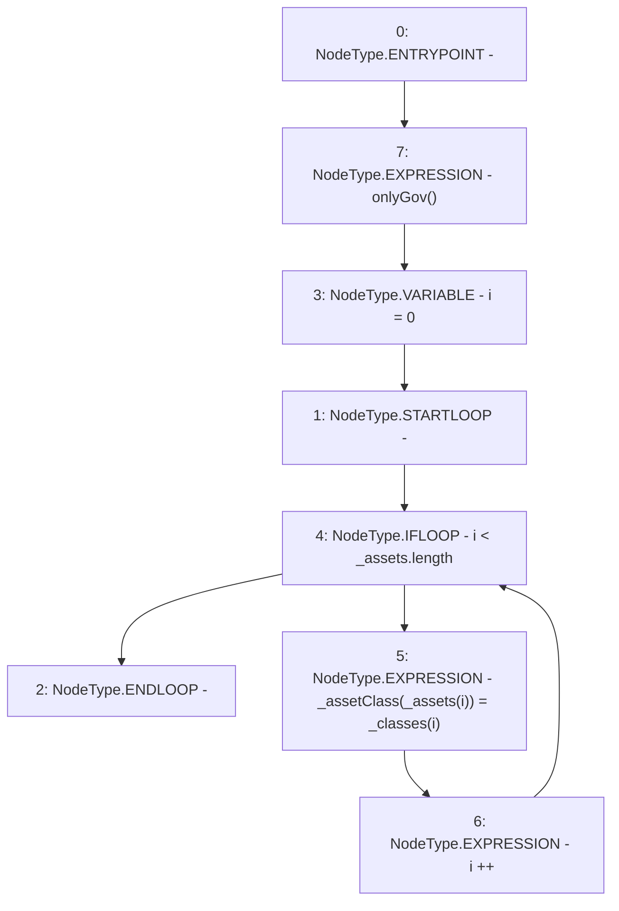

# Context: MochiProfileV0.changeAssetClass

**Contract:** `MochiProfileV0` (Inherits: IMochiProfile)
**Signature:** `changeAssetClass(address[],AssetClass[])`
**Method Selector ID:** `0x1f7709d9`
**Visibility:** `external`
**Environment-Free:** `No (reads EVM state context)`
**Modifiers:**
- `onlyGov`
  ```solidity
  modifier onlyGov() {
          require(msg.sender == engine.governance(), "!gov");
          _;
      }
  ```

### State Variables Interaction
- **Reads:** None
- **Writes:** _assetClass

### Environment & Verification Flags
- **Uses Foundry Cheatcodes:** No
- **Has Echidna Properties:** No

### Internal Calls Tree
- None

### External Calls / Value Transfers
- None

### Control Flow Graph (CFG)


### Source Mapping
Declared in: `certora-ac-datasets/detasets/web3bugs/dataset/web3bugs/42/projects/mochi-core/contracts/profile/MochiProfileV0.sol` on lines **82** to **89**

```solidity
    function changeAssetClass(
        address[] calldata _assets,
        AssetClass[] calldata _classes
    ) external override onlyGov {
        for (uint256 i = 0; i < _assets.length; i++) {
            _assetClass[_assets[i]] = _classes[i];
        }
    }

```
