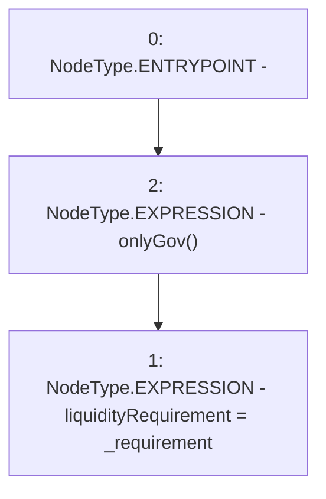

# Context: MochiProfileV0.changeLiquidityRequirement

**Contract:** `MochiProfileV0` (Inherits: IMochiProfile)
**Signature:** `changeLiquidityRequirement(uint256)`
**Method Selector ID:** `0x4326b083`
**Visibility:** `external`
**Environment-Free:** `No (reads EVM state context)`
**Modifiers:**
- `onlyGov`
  ```solidity
  modifier onlyGov() {
          require(msg.sender == engine.governance(), "!gov");
          _;
      }
  ```

### State Variables Interaction
- **Reads:** None
- **Writes:** liquidityRequirement

### Environment & Verification Flags
- **Uses Foundry Cheatcodes:** No
- **Has Echidna Properties:** No

### Internal Calls Tree
- None

### External Calls / Value Transfers
- None

### Control Flow Graph (CFG)


### Source Mapping
Declared in: `certora-ac-datasets/detasets/web3bugs/dataset/web3bugs/42/projects/mochi-core/contracts/profile/MochiProfileV0.sol` on lines **50** to **56**

```solidity
    function changeLiquidityRequirement(uint256 _requirement)
        external
        override
        onlyGov
    {
        liquidityRequirement = _requirement;
    }

```
