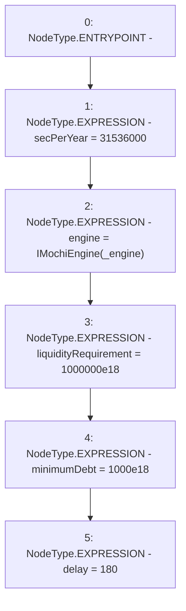

# Context: MochiProfileV0.constructor

**Contract:** `MochiProfileV0` (Inherits: IMochiProfile)
**Signature:** `constructor(address)`
**Method Selector ID:** `0xf8a6c595`
**Visibility:** `public`
**Environment-Free:** `Yes`
**Modifiers:** None

### State Variables Interaction
- **Reads:** None
- **Writes:** delay, engine, liquidityRequirement, minimumDebt, secPerYear

### Environment & Verification Flags
- **Uses Foundry Cheatcodes:** No
- **Has Echidna Properties:** No

### Internal Calls Tree
- None

### External Calls / Value Transfers
- None

### Control Flow Graph (CFG)


### Source Mapping
Declared in: `certora-ac-datasets/detasets/web3bugs/dataset/web3bugs/42/projects/mochi-core/contracts/profile/MochiProfileV0.sol` on lines **27** to **34**

```solidity
    constructor(address _engine) {
        secPerYear = 31536000;
        engine = IMochiEngine(_engine);

        liquidityRequirement = 1000000e18; // 1million dollar
        minimumDebt = 1000e18;
        delay = 3 minutes;
    }

```
