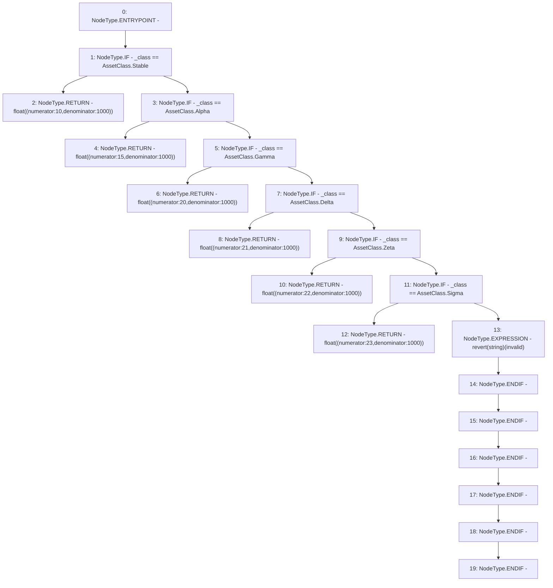

# Context: MochiProfileV0.maxFee

**Contract:** `MochiProfileV0` (Inherits: IMochiProfile)
**Signature:** `maxFee(AssetClass) returns (float)`
**Method Selector ID:** `0xfa6a5f2c`
**Visibility:** `public`
**Environment-Free:** `Yes`
**Modifiers:** None

### State Variables Interaction
- **Reads:** None
- **Writes:** None

### Assertion Checks & Business Requirements
- revert: `revert(string)(invalid)`

### Environment & Verification Flags
- **Uses Foundry Cheatcodes:** No
- **Has Echidna Properties:** No

### Internal Calls Tree
- None

### External Calls / Value Transfers
- None

### Control Flow Graph (CFG)


### Source Mapping
Declared in: `certora-ac-datasets/detasets/web3bugs/dataset/web3bugs/42/projects/mochi-core/contracts/profile/MochiProfileV0.sol` on lines **224** to **240**

```solidity
    function maxFee(AssetClass _class) public pure returns (float memory) {
        if (_class == AssetClass.Stable) {
            return float({numerator: 10, denominator: 1000});
        } else if (_class == AssetClass.Alpha) {
            return float({numerator: 15, denominator: 1000});
        } else if (_class == AssetClass.Gamma) {
            return float({numerator: 20, denominator: 1000});
        } else if (_class == AssetClass.Delta) {
            return float({numerator: 21, denominator: 1000});
        } else if (_class == AssetClass.Zeta) {
            return float({numerator: 22, denominator: 1000});
        } else if (_class == AssetClass.Sigma) {
            return float({numerator: 23, denominator: 1000});
        } else {
            revert("invalid");
        }
    }

```
