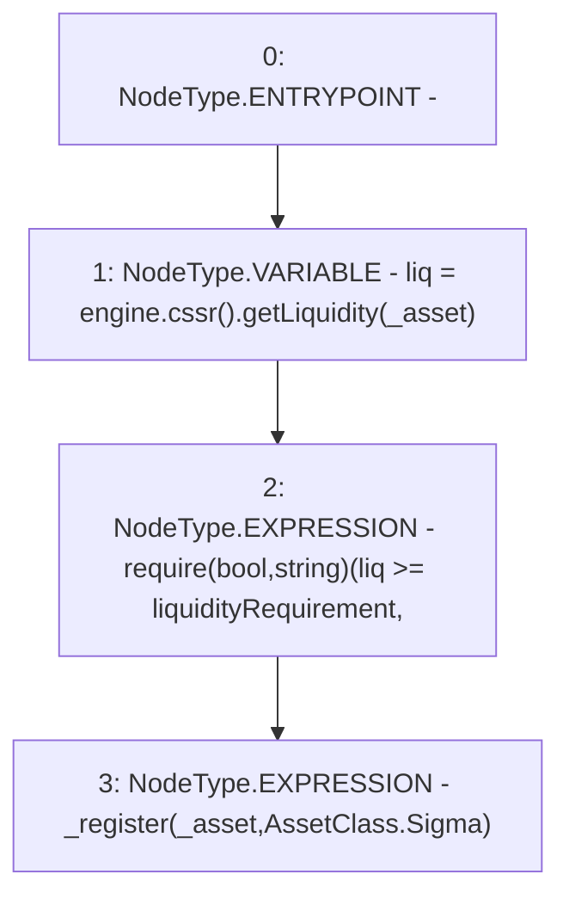

# Context: MochiProfileV0.registerAsset

**Contract:** `MochiProfileV0` (Inherits: IMochiProfile)
**Signature:** `registerAsset(address)`
**Method Selector ID:** `0xd312998f`
**Visibility:** `external`
**Environment-Free:** `Yes`
**Modifiers:** None

### State Variables Interaction
- **Reads:** engine, liquidityRequirement
- **Writes:** None

### Assertion Checks & Business Requirements
- require/assert: `require(bool,string)(liq >= liquidityRequirement,<liquidity)`

### Environment & Verification Flags
- **Uses Foundry Cheatcodes:** No
- **Has Echidna Properties:** No

### Internal Calls Tree
- None

### External Calls / Value Transfers
- `ICSSRRouter.TMP_3(uint256) = HIGH_LEVEL_CALL, dest:TMP_2(ICSSRRouter), function:getLiquidity, arguments:['_asset']  `
- `IMochiEngine.TMP_2(ICSSRRouter) = HIGH_LEVEL_CALL, dest:engine(IMochiEngine), function:cssr, arguments:[]  `

### Control Flow Graph (CFG)


### Source Mapping
Declared in: `certora-ac-datasets/detasets/web3bugs/dataset/web3bugs/42/projects/mochi-core/contracts/profile/MochiProfileV0.sol` on lines **58** to **62**

```solidity
    function registerAsset(address _asset) external {
        uint256 liq = engine.cssr().getLiquidity(_asset);
        require(liq >= liquidityRequirement, "<liquidity");
        _register(_asset, AssetClass.Sigma);
    }

```
