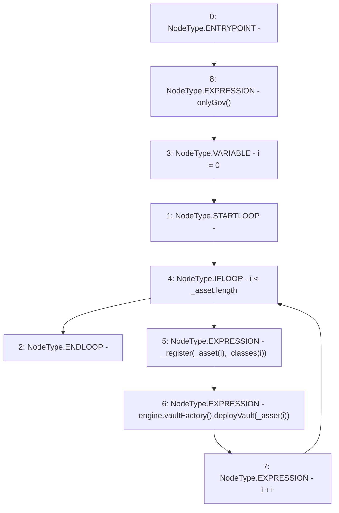

# Context: MochiProfileV0.registerAssetByGov

**Contract:** `MochiProfileV0` (Inherits: IMochiProfile)
**Signature:** `registerAssetByGov(address[],AssetClass[])`
**Method Selector ID:** `0x957853a9`
**Visibility:** `external`
**Environment-Free:** `No (reads EVM state context)`
**Modifiers:**
- `onlyGov`
  ```solidity
  modifier onlyGov() {
          require(msg.sender == engine.governance(), "!gov");
          _;
      }
  ```

### State Variables Interaction
- **Reads:** engine
- **Writes:** None

### Environment & Verification Flags
- **Uses Foundry Cheatcodes:** No
- **Has Echidna Properties:** No

### Internal Calls Tree
- None

### External Calls / Value Transfers
- `IMochiVaultFactory.TMP_10(IMochiVault) = HIGH_LEVEL_CALL, dest:TMP_9(IMochiVaultFactory), function:deployVault, arguments:['REF_9']  `
- `IMochiEngine.TMP_9(IMochiVaultFactory) = HIGH_LEVEL_CALL, dest:engine(IMochiEngine), function:vaultFactory, arguments:[]  `

### Control Flow Graph (CFG)


### Source Mapping
Declared in: `certora-ac-datasets/detasets/web3bugs/dataset/web3bugs/42/projects/mochi-core/contracts/profile/MochiProfileV0.sol` on lines **64** to **72**

```solidity
    function registerAssetByGov(
        address[] calldata _asset,
        AssetClass[] calldata _classes
    ) external onlyGov {
        for (uint256 i = 0; i < _asset.length; i++) {
            _register(_asset[i], _classes[i]);
            engine.vaultFactory().deployVault(_asset[i]);
        }
    }

```
