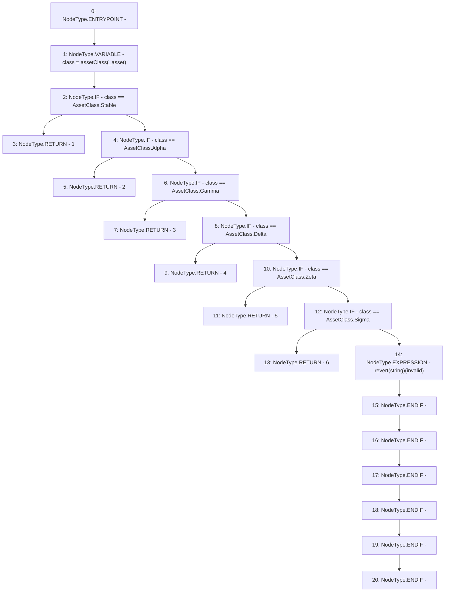

# Context: MochiProfileV0.riskFactor

**Contract:** `MochiProfileV0` (Inherits: IMochiProfile)
**Signature:** `riskFactor(address) returns (uint256)`
**Method Selector ID:** `0x13a475ba`
**Visibility:** `public`
**Environment-Free:** `Yes`
**Modifiers:** None

### State Variables Interaction
- **Reads:** None
- **Writes:** None

### Assertion Checks & Business Requirements
- revert: `revert(string)(invalid)`

### Environment & Verification Flags
- **Uses Foundry Cheatcodes:** No
- **Has Echidna Properties:** No

### Internal Calls Tree
- None

### External Calls / Value Transfers
- None

### Control Flow Graph (CFG)


### Source Mapping
Declared in: `certora-ac-datasets/detasets/web3bugs/dataset/web3bugs/42/projects/mochi-core/contracts/profile/MochiProfileV0.sol` on lines **129** to **146**

```solidity
    function riskFactor(address _asset) public view returns (uint256) {
        AssetClass class = assetClass(_asset);
        if (class == AssetClass.Stable) {
            return 1;
        } else if (class == AssetClass.Alpha) {
            return 2;
        } else if (class == AssetClass.Gamma) {
            return 3;
        } else if (class == AssetClass.Delta) {
            return 4;
        } else if (class == AssetClass.Zeta) {
            return 5;
        } else if (class == AssetClass.Sigma) {
            return 6;
        } else {
            revert("invalid");
        }
    }

```
