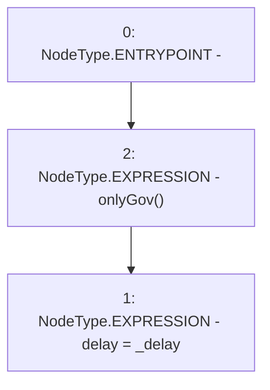

# Context: MochiProfileV0.setDelay

**Contract:** `MochiProfileV0` (Inherits: IMochiProfile)
**Signature:** `setDelay(uint256)`
**Method Selector ID:** `0xe177246e`
**Visibility:** `external`
**Environment-Free:** `No (reads EVM state context)`
**Modifiers:**
- `onlyGov`
  ```solidity
  modifier onlyGov() {
          require(msg.sender == engine.governance(), "!gov");
          _;
      }
  ```

### State Variables Interaction
- **Reads:** None
- **Writes:** delay

### Environment & Verification Flags
- **Uses Foundry Cheatcodes:** No
- **Has Echidna Properties:** No

### Internal Calls Tree
- None

### External Calls / Value Transfers
- None

### Control Flow Graph (CFG)


### Source Mapping
Declared in: `certora-ac-datasets/detasets/web3bugs/dataset/web3bugs/42/projects/mochi-core/contracts/profile/MochiProfileV0.sol` on lines **100** to **102**

```solidity
    function setDelay(uint256 _delay) external onlyGov {
        delay = _delay;
    }

```
