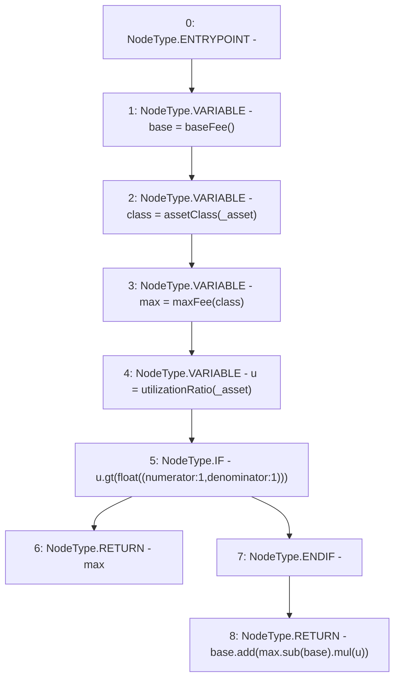

# Context: MochiProfileV0.stabilityFee

**Contract:** `MochiProfileV0` (Inherits: IMochiProfile)
**Signature:** `stabilityFee(address) returns (float)`
**Method Selector ID:** `0x997a2572`
**Visibility:** `public`
**Environment-Free:** `Yes`
**Modifiers:** None

### State Variables Interaction
- **Reads:** None
- **Writes:** None

### Environment & Verification Flags
- **Uses Foundry Cheatcodes:** No
- **Has Echidna Properties:** No

### Internal Calls Tree
- None

### External Calls / Value Transfers
- `Float.TMP_105(float) = LIBRARY_CALL, dest:Float, function:Float.sub(float,float), arguments:['max', 'base'] `
- `Float.TMP_104(bool) = LIBRARY_CALL, dest:Float, function:Float.gt(float,float), arguments:['u', 'TMP_103'] `
- `Float.TMP_106(float) = LIBRARY_CALL, dest:Float, function:Float.mul(float,float), arguments:['TMP_105', 'u'] `
- `Float.TMP_107(float) = LIBRARY_CALL, dest:Float, function:Float.add(float,float), arguments:['base', 'TMP_106'] `

### Control Flow Graph (CFG)


### Source Mapping
Declared in: `certora-ac-datasets/detasets/web3bugs/dataset/web3bugs/42/projects/mochi-core/contracts/profile/MochiProfileV0.sol` on lines **242** to **256**

```solidity
    function stabilityFee(address _asset)
        public
        view
        override
        returns (float memory)
    {
        float memory base = baseFee();
        AssetClass class = assetClass(_asset);
        float memory max = maxFee(class);
        float memory u = utilizationRatio(_asset);
        if (u.gt(float({numerator: 1, denominator: 1}))) {
            return max;
        }
        return base.add(max.sub(base).mul(u));
    }

```
