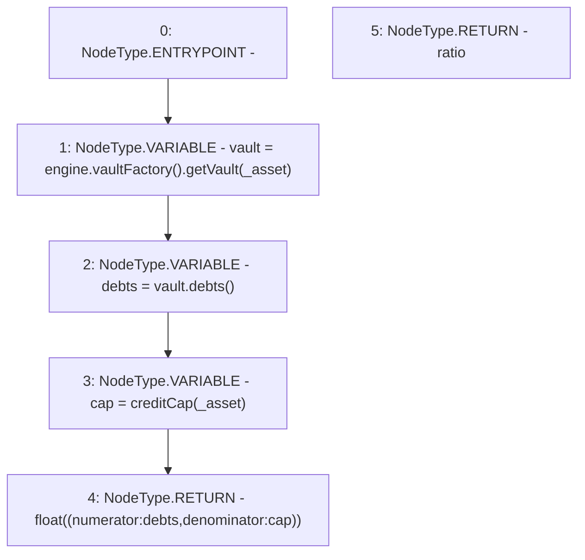

# Context: MochiProfileV0.utilizationRatio

**Contract:** `MochiProfileV0` (Inherits: IMochiProfile)
**Signature:** `utilizationRatio(address) returns (float)`
**Method Selector ID:** `0x8dd20d28`
**Visibility:** `public`
**Environment-Free:** `Yes`
**Modifiers:** None

### State Variables Interaction
- **Reads:** creditCap, engine
- **Writes:** None

### Environment & Verification Flags
- **Uses Foundry Cheatcodes:** No
- **Has Echidna Properties:** No

### Internal Calls Tree
- None

### External Calls / Value Transfers
- `IMochiVaultFactory.TMP_115(IMochiVault) = HIGH_LEVEL_CALL, dest:TMP_114(IMochiVaultFactory), function:getVault, arguments:['_asset']  `
- `IMochiEngine.TMP_114(IMochiVaultFactory) = HIGH_LEVEL_CALL, dest:engine(IMochiEngine), function:vaultFactory, arguments:[]  `
- `IMochiVault.TMP_116(uint256) = HIGH_LEVEL_CALL, dest:vault(IMochiVault), function:debts, arguments:[]  `

### Control Flow Graph (CFG)


### Source Mapping
Declared in: `certora-ac-datasets/detasets/web3bugs/dataset/web3bugs/42/projects/mochi-core/contracts/profile/MochiProfileV0.sol` on lines **272** to **282**

```solidity
    function utilizationRatio(address _asset)
        public
        view
        override
        returns (float memory ratio)
    {
        IMochiVault vault = engine.vaultFactory().getVault(_asset);
        uint256 debts = vault.debts();
        uint256 cap = creditCap[_asset];
        return float({numerator: debts, denominator: cap});
    }

```
