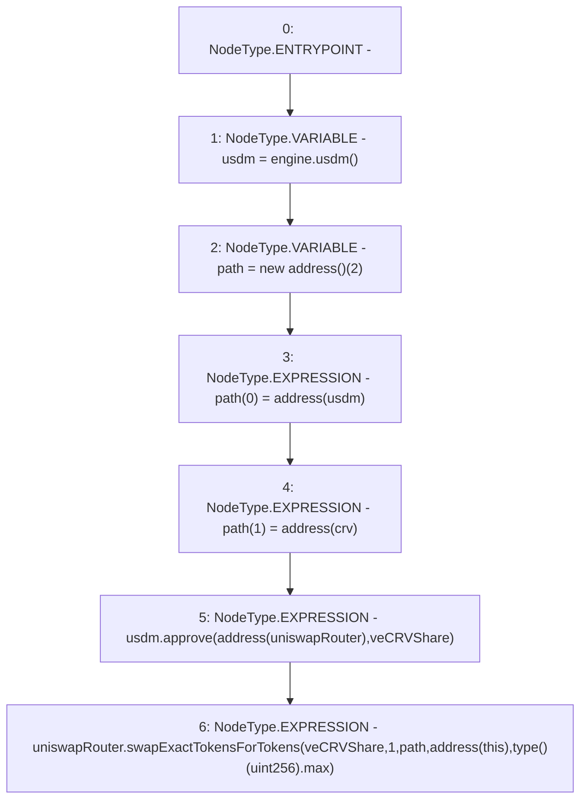

# Context: MochiTreasuryV0._buyCRV

**Contract:** `MochiTreasuryV0` (Inherits: None)
**Signature:** `_buyCRV()`
**Method Selector ID:** `Internal (No Method ID)`
**Visibility:** `internal`
**Environment-Free:** `Yes`
**Modifiers:** None

### State Variables Interaction
- **Reads:** crv, engine, uniswapRouter, veCRVShare
- **Writes:** None

### Environment & Verification Flags
- **Uses Foundry Cheatcodes:** No
- **Has Echidna Properties:** No

### Internal Calls Tree
- None

### External Calls / Value Transfers
- `IUniswapV2Router02.TMP_47(uint256[]) = HIGH_LEVEL_CALL, dest:uniswapRouter(IUniswapV2Router02), function:swapExactTokensForTokens, arguments:['veCRVShare', '1', 'path', 'TMP_44', 'TMP_46']  `
- `IMochiEngine.TMP_37(IUSDM) = HIGH_LEVEL_CALL, dest:engine(IMochiEngine), function:usdm, arguments:[]  `
- `IUSDM.TMP_43(bool) = HIGH_LEVEL_CALL, dest:usdm(IUSDM), function:approve, arguments:['TMP_42', 'veCRVShare']  `

### Control Flow Graph (CFG)


### Source Mapping
Declared in: `certora-ac-datasets/detasets/web3bugs/dataset/web3bugs/42/projects/mochi-core/contracts/treasury/MochiTreasuryV0.sol` on lines **81** to **94**

```solidity
    function _buyCRV() internal {
        IUSDM usdm = engine.usdm();
        address[] memory path = new address[](2);
        path[0] = address(usdm);
        path[1] = address(crv);
        usdm.approve(address(uniswapRouter), veCRVShare);
        uniswapRouter.swapExactTokensForTokens(
            veCRVShare,
            1,
            path,
            address(this),
            type(uint256).max
        );
    }

```
