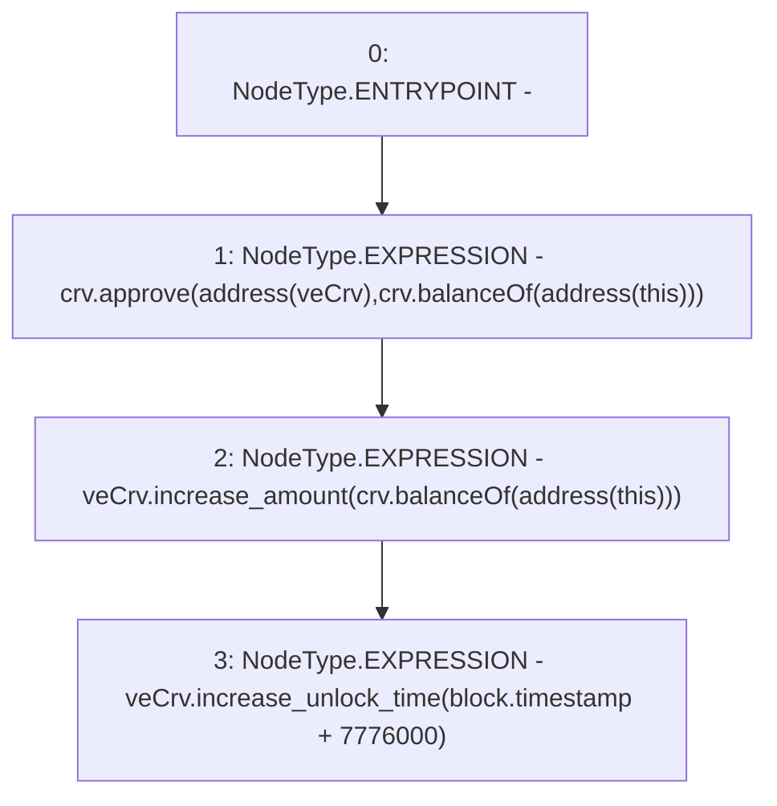

# Context: MochiTreasuryV0._lockCRV

**Contract:** `MochiTreasuryV0` (Inherits: None)
**Signature:** `_lockCRV()`
**Method Selector ID:** `Internal (No Method ID)`
**Visibility:** `internal`
**Environment-Free:** `No (reads EVM state context)`
**Modifiers:** None

### State Variables Interaction
- **Reads:** crv, veCrv
- **Writes:** None

### Environment & Verification Flags
- **Uses Foundry Cheatcodes:** No
- **Has Echidna Properties:** No

### Internal Calls Tree
- None

### External Calls / Value Transfers
- `ICurveVotingEscrow.HIGH_LEVEL_CALL, dest:veCrv(ICurveVotingEscrow), function:increase_amount, arguments:['TMP_53']  `
- `IERC20.TMP_50(uint256) = HIGH_LEVEL_CALL, dest:crv(IERC20), function:balanceOf, arguments:['TMP_49']  `
- `IERC20.TMP_53(uint256) = HIGH_LEVEL_CALL, dest:crv(IERC20), function:balanceOf, arguments:['TMP_52']  `
- `ICurveVotingEscrow.HIGH_LEVEL_CALL, dest:veCrv(ICurveVotingEscrow), function:increase_unlock_time, arguments:['TMP_55']  `
- `IERC20.TMP_51(bool) = HIGH_LEVEL_CALL, dest:crv(IERC20), function:approve, arguments:['TMP_48', 'TMP_50']  `

### Control Flow Graph (CFG)


### Source Mapping
Declared in: `certora-ac-datasets/detasets/web3bugs/dataset/web3bugs/42/projects/mochi-core/contracts/treasury/MochiTreasuryV0.sol` on lines **96** to **100**

```solidity
    function _lockCRV() internal {
        crv.approve(address(veCrv), crv.balanceOf(address(this)));
        veCrv.increase_amount(crv.balanceOf(address(this)));
        veCrv.increase_unlock_time(block.timestamp + 90 days);
    }

```
