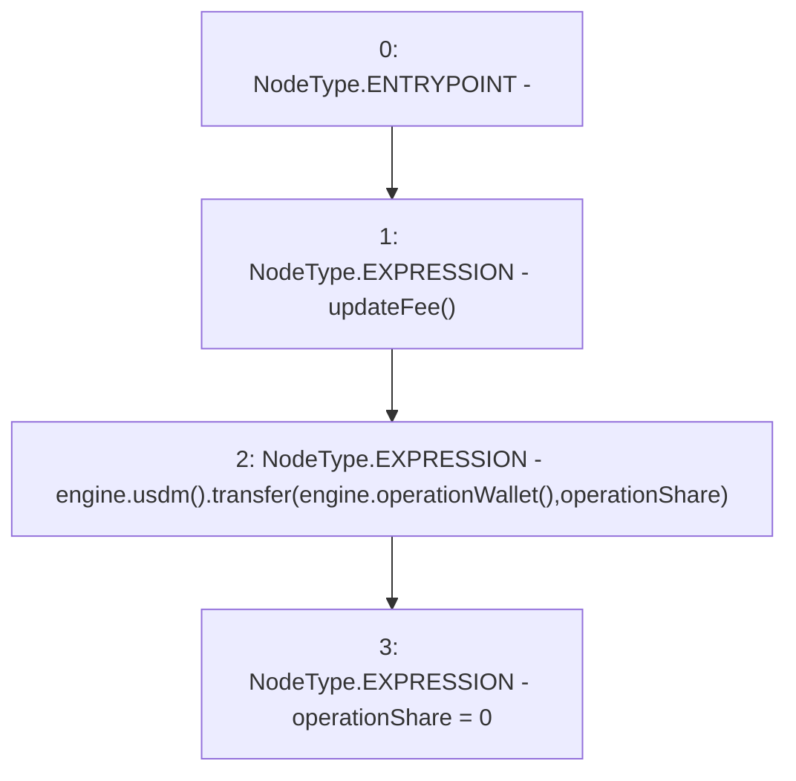

# Context: MochiTreasuryV0.claimOperationCost

**Contract:** `MochiTreasuryV0` (Inherits: None)
**Signature:** `claimOperationCost()`
**Method Selector ID:** `0x5e5097b2`
**Visibility:** `external`
**Environment-Free:** `Yes`
**Modifiers:** None

### State Variables Interaction
- **Reads:** engine, operationShare
- **Writes:** operationShare

### Environment & Verification Flags
- **Uses Foundry Cheatcodes:** No
- **Has Echidna Properties:** No

### Internal Calls Tree
- None

### External Calls / Value Transfers
- `IMochiEngine.TMP_31(address) = HIGH_LEVEL_CALL, dest:engine(IMochiEngine), function:operationWallet, arguments:[]  `
- `IMochiEngine.TMP_30(IUSDM) = HIGH_LEVEL_CALL, dest:engine(IMochiEngine), function:usdm, arguments:[]  `
- `IUSDM.TMP_32(bool) = HIGH_LEVEL_CALL, dest:TMP_30(IUSDM), function:transfer, arguments:['TMP_31', 'operationShare']  `

### Control Flow Graph (CFG)


### Source Mapping
Declared in: `certora-ac-datasets/detasets/web3bugs/dataset/web3bugs/42/projects/mochi-core/contracts/treasury/MochiTreasuryV0.sol` on lines **67** to **71**

```solidity
    function claimOperationCost() external {
        updateFee();
        engine.usdm().transfer(engine.operationWallet(), operationShare);
        operationShare = 0;
    }

```
