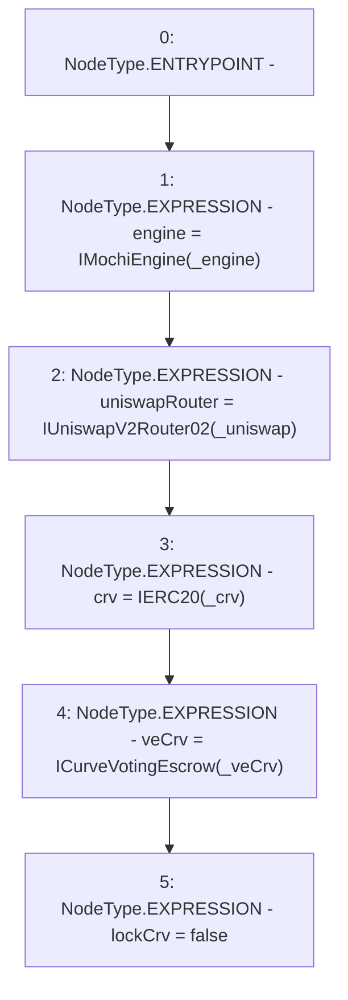

# Context: MochiTreasuryV0.constructor

**Contract:** `MochiTreasuryV0` (Inherits: None)
**Signature:** `constructor(address,address,address,address)`
**Method Selector ID:** `0xb0647061`
**Visibility:** `public`
**Environment-Free:** `Yes`
**Modifiers:** None

### State Variables Interaction
- **Reads:** None
- **Writes:** crv, engine, lockCrv, uniswapRouter, veCrv

### Environment & Verification Flags
- **Uses Foundry Cheatcodes:** No
- **Has Echidna Properties:** No

### Internal Calls Tree
- None

### External Calls / Value Transfers
- None

### Control Flow Graph (CFG)


### Source Mapping
Declared in: `certora-ac-datasets/detasets/web3bugs/dataset/web3bugs/42/projects/mochi-core/contracts/treasury/MochiTreasuryV0.sol` on lines **20** to **31**

```solidity
    constructor(
        address _engine,
        address _uniswap,
        address _crv,
        address _veCrv
    ) {
        engine = IMochiEngine(_engine);
        uniswapRouter = IUniswapV2Router02(_uniswap);
        crv = IERC20(_crv);
        veCrv = ICurveVotingEscrow(_veCrv);
        lockCrv = false;
    }

```
