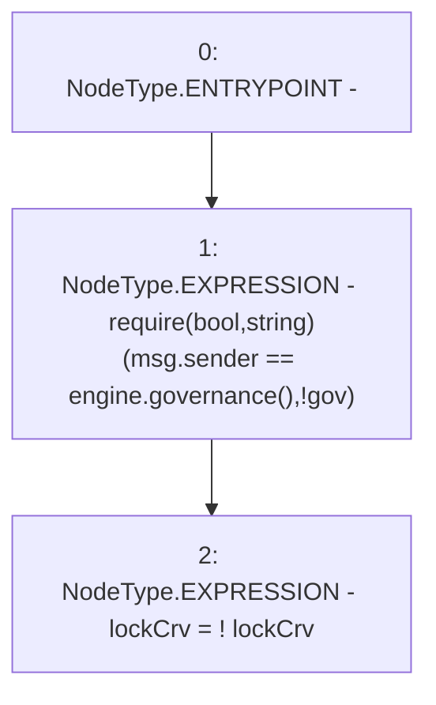

# Context: MochiTreasuryV0.toggleLocking

**Contract:** `MochiTreasuryV0` (Inherits: None)
**Signature:** `toggleLocking()`
**Method Selector ID:** `0xdacac82b`
**Visibility:** `external`
**Environment-Free:** `No (reads EVM state context)`
**Modifiers:** None

### State Variables Interaction
- **Reads:** engine, lockCrv
- **Writes:** lockCrv

### Assertion Checks & Business Requirements
- require/assert: `require(bool,string)(msg.sender == engine.governance(),!gov)`

### Environment & Verification Flags
- **Uses Foundry Cheatcodes:** No
- **Has Echidna Properties:** No

### Internal Calls Tree
- None

### External Calls / Value Transfers
- `IMochiEngine.TMP_18(address) = HIGH_LEVEL_CALL, dest:engine(IMochiEngine), function:governance, arguments:[]  `

### Control Flow Graph (CFG)


### Source Mapping
Declared in: `certora-ac-datasets/detasets/web3bugs/dataset/web3bugs/42/projects/mochi-core/contracts/treasury/MochiTreasuryV0.sol` on lines **54** to **57**

```solidity
    function toggleLocking() external {
        require(msg.sender == engine.governance(), "!gov");
        lockCrv = !lockCrv;
    }

```
