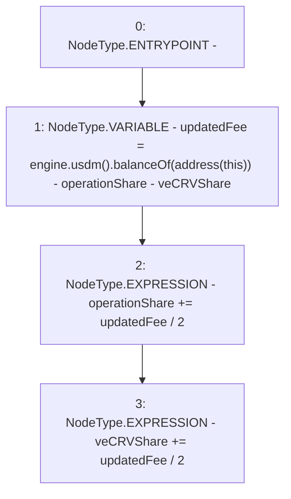

# Context: MochiTreasuryV0.updateFee

**Contract:** `MochiTreasuryV0` (Inherits: None)
**Signature:** `updateFee()`
**Method Selector ID:** `0x758cdcf0`
**Visibility:** `public`
**Environment-Free:** `Yes`
**Modifiers:** None

### State Variables Interaction
- **Reads:** engine, operationShare, veCRVShare
- **Writes:** operationShare, veCRVShare

### Environment & Verification Flags
- **Uses Foundry Cheatcodes:** No
- **Has Echidna Properties:** No

### Internal Calls Tree
- None

### External Calls / Value Transfers
- `IMochiEngine.TMP_22(IUSDM) = HIGH_LEVEL_CALL, dest:engine(IMochiEngine), function:usdm, arguments:[]  `
- `IUSDM.TMP_24(uint256) = HIGH_LEVEL_CALL, dest:TMP_22(IUSDM), function:balanceOf, arguments:['TMP_23']  `

### Control Flow Graph (CFG)


### Source Mapping
Declared in: `certora-ac-datasets/detasets/web3bugs/dataset/web3bugs/42/projects/mochi-core/contracts/treasury/MochiTreasuryV0.sol` on lines **59** to **65**

```solidity
    function updateFee() public {
        uint256 updatedFee = engine.usdm().balanceOf(address(this)) -
            operationShare -
            veCRVShare;
        operationShare += updatedFee / 2;
        veCRVShare += updatedFee / 2;
    }

```
