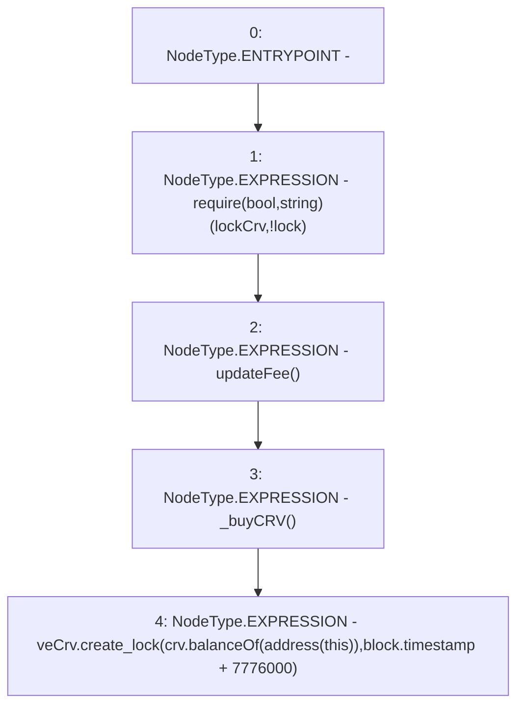

# Context: MochiTreasuryV0.veCRVInitialize

**Contract:** `MochiTreasuryV0` (Inherits: None)
**Signature:** `veCRVInitialize()`
**Method Selector ID:** `0xf55fd192`
**Visibility:** `external`
**Environment-Free:** `No (reads EVM state context)`
**Modifiers:** None

### State Variables Interaction
- **Reads:** crv, lockCrv, veCrv
- **Writes:** None

### Assertion Checks & Business Requirements
- require/assert: `require(bool,string)(lockCrv,!lock)`

### Environment & Verification Flags
- **Uses Foundry Cheatcodes:** No
- **Has Echidna Properties:** No

### Internal Calls Tree
- None

### External Calls / Value Transfers
- `IERC20.TMP_15(uint256) = HIGH_LEVEL_CALL, dest:crv(IERC20), function:balanceOf, arguments:['TMP_14']  `
- `ICurveVotingEscrow.HIGH_LEVEL_CALL, dest:veCrv(ICurveVotingEscrow), function:create_lock, arguments:['TMP_15', 'TMP_16']  `

### Control Flow Graph (CFG)


### Source Mapping
Declared in: `certora-ac-datasets/detasets/web3bugs/dataset/web3bugs/42/projects/mochi-core/contracts/treasury/MochiTreasuryV0.sol` on lines **44** to **52**

```solidity
    function veCRVInitialize() external {
        require(lockCrv, "!lock");
        updateFee();
        _buyCRV();
        veCrv.create_lock(
            crv.balanceOf(address(this)),
            block.timestamp + 90 days
        );
    }

```
