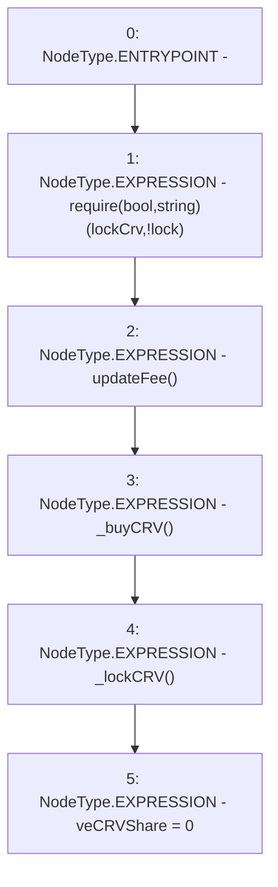

# Context: MochiTreasuryV0.veCRVlock

**Contract:** `MochiTreasuryV0` (Inherits: None)
**Signature:** `veCRVlock()`
**Method Selector ID:** `0x73e5ec06`
**Visibility:** `external`
**Environment-Free:** `No (reads EVM state context)`
**Modifiers:** None

### State Variables Interaction
- **Reads:** lockCrv
- **Writes:** veCRVShare

### Assertion Checks & Business Requirements
- require/assert: `require(bool,string)(lockCrv,!lock)`

### Environment & Verification Flags
- **Uses Foundry Cheatcodes:** No
- **Has Echidna Properties:** No

### Internal Calls Tree
- None

### External Calls / Value Transfers
- None

### Control Flow Graph (CFG)


### Source Mapping
Declared in: `certora-ac-datasets/detasets/web3bugs/dataset/web3bugs/42/projects/mochi-core/contracts/treasury/MochiTreasuryV0.sol` on lines **73** to **79**

```solidity
    function veCRVlock() external {
        require(lockCrv, "!lock");
        updateFee();
        _buyCRV();
        _lockCRV();
        veCRVShare = 0;
    }

```
