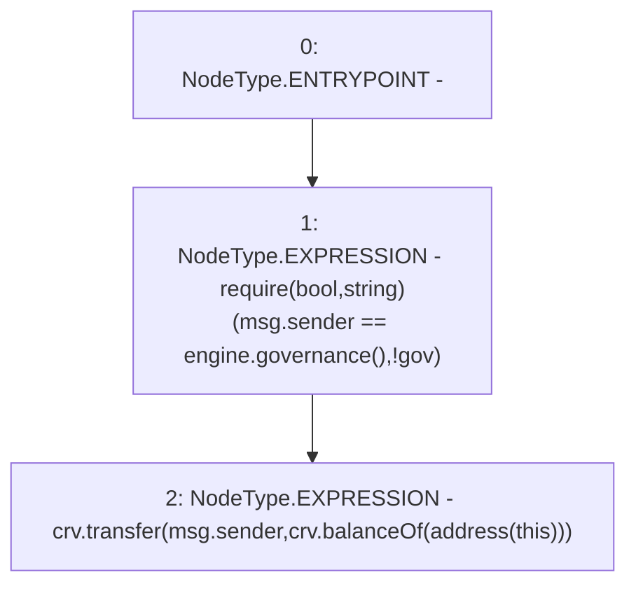

# Context: MochiTreasuryV0.withdrawCRV

**Contract:** `MochiTreasuryV0` (Inherits: None)
**Signature:** `withdrawCRV()`
**Method Selector ID:** `0xf1e94426`
**Visibility:** `external`
**Environment-Free:** `No (reads EVM state context)`
**Modifiers:** None

### State Variables Interaction
- **Reads:** crv, engine
- **Writes:** None

### Assertion Checks & Business Requirements
- require/assert: `require(bool,string)(msg.sender == engine.governance(),!gov)`

### Environment & Verification Flags
- **Uses Foundry Cheatcodes:** No
- **Has Echidna Properties:** No

### Internal Calls Tree
- None

### External Calls / Value Transfers
- `IERC20.TMP_8(uint256) = HIGH_LEVEL_CALL, dest:crv(IERC20), function:balanceOf, arguments:['TMP_7']  `
- `IMochiEngine.TMP_4(address) = HIGH_LEVEL_CALL, dest:engine(IMochiEngine), function:governance, arguments:[]  `
- `IERC20.TMP_9(bool) = HIGH_LEVEL_CALL, dest:crv(IERC20), function:transfer, arguments:['msg.sender', 'TMP_8']  `

### Control Flow Graph (CFG)


### Source Mapping
Declared in: `certora-ac-datasets/detasets/web3bugs/dataset/web3bugs/42/projects/mochi-core/contracts/treasury/MochiTreasuryV0.sol` on lines **35** to **38**

```solidity
    function withdrawCRV() external {
        require(msg.sender == engine.governance(), "!gov");
        crv.transfer(msg.sender, crv.balanceOf(address(this)));
    }

```
