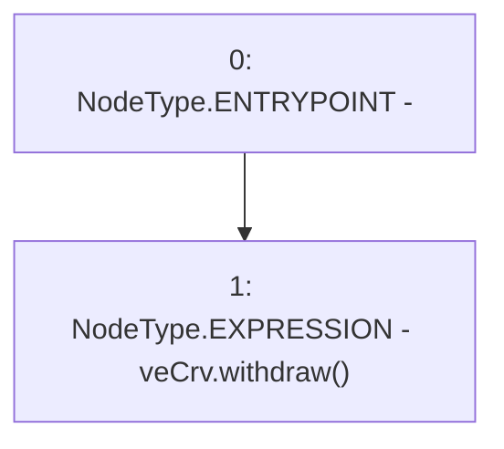

# Context: MochiTreasuryV0.withdrawLock

**Contract:** `MochiTreasuryV0` (Inherits: None)
**Signature:** `withdrawLock()`
**Method Selector ID:** `0x5c388ca6`
**Visibility:** `external`
**Environment-Free:** `Yes`
**Modifiers:** None

### State Variables Interaction
- **Reads:** veCrv
- **Writes:** None

### Environment & Verification Flags
- **Uses Foundry Cheatcodes:** No
- **Has Echidna Properties:** No

### Internal Calls Tree
- None

### External Calls / Value Transfers
- `ICurveVotingEscrow.HIGH_LEVEL_CALL, dest:veCrv(ICurveVotingEscrow), function:withdraw, arguments:[]  `

### Control Flow Graph (CFG)


### Source Mapping
Declared in: `certora-ac-datasets/detasets/web3bugs/dataset/web3bugs/42/projects/mochi-core/contracts/treasury/MochiTreasuryV0.sol` on lines **40** to **42**

```solidity
    function withdrawLock() external {
        veCrv.withdraw();
    }

```
