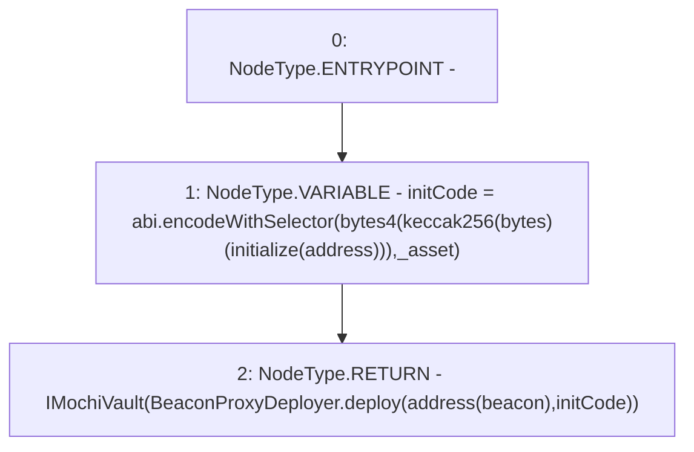

# Context: MochiVaultFactory.deployVault

**Contract:** `MochiVaultFactory` (Inherits: IMochiVaultFactory)
**Signature:** `deployVault(address) returns (IMochiVault)`
**Method Selector ID:** `0x5eb512e7`
**Visibility:** `external`
**Environment-Free:** `Yes`
**Modifiers:** None

### State Variables Interaction
- **Reads:** beacon
- **Writes:** None

### Environment & Verification Flags
- **Uses Foundry Cheatcodes:** No
- **Has Echidna Properties:** No

### Internal Calls Tree
- None

### External Calls / Value Transfers
- `BeaconProxyDeployer.TMP_147(address) = LIBRARY_CALL, dest:BeaconProxyDeployer, function:BeaconProxyDeployer.deploy(address,bytes), arguments:['TMP_146', 'initCode'] `

### Control Flow Graph (CFG)


### Source Mapping
Declared in: `certora-ac-datasets/detasets/web3bugs/dataset/web3bugs/42/projects/mochi-core/contracts/vault/MochiVaultFactory.sol` on lines **26** to **37**

```solidity
    function deployVault(address _asset)
        external
        override
        returns (IMochiVault)
    {
        bytes memory initCode = abi.encodeWithSelector(
            bytes4(keccak256("initialize(address)")),
            _asset
        );
        return
            IMochiVault(BeaconProxyDeployer.deploy(address(beacon), initCode));
    }

```
