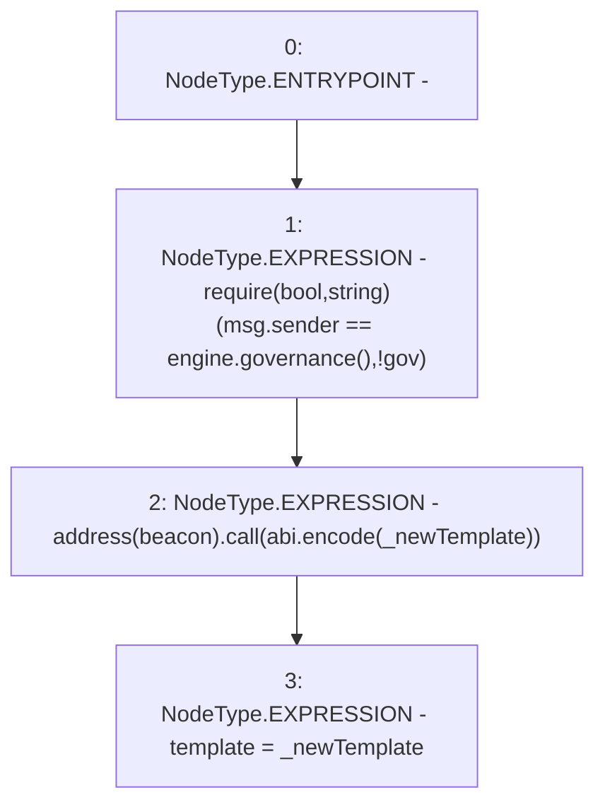

# Context: MochiVaultFactory.updateTemplate

**Contract:** `MochiVaultFactory` (Inherits: IMochiVaultFactory)
**Signature:** `updateTemplate(address)`
**Method Selector ID:** `0xfbc1f718`
**Visibility:** `external`
**Environment-Free:** `No (reads EVM state context)`
**Modifiers:** None

### State Variables Interaction
- **Reads:** beacon, engine
- **Writes:** template

### Assertion Checks & Business Requirements
- require/assert: `require(bool,string)(msg.sender == engine.governance(),!gov)`

### Environment & Verification Flags
- **Uses Foundry Cheatcodes:** No
- **Has Echidna Properties:** No

### Internal Calls Tree
- None

### External Calls / Value Transfers
- `low-level-call`
- `IMochiEngine.TMP_138(address) = HIGH_LEVEL_CALL, dest:engine(IMochiEngine), function:governance, arguments:[]  `

### Control Flow Graph (CFG)


### Source Mapping
Declared in: `certora-ac-datasets/detasets/web3bugs/dataset/web3bugs/42/projects/mochi-core/contracts/vault/MochiVaultFactory.sol` on lines **20** to **24**

```solidity
    function updateTemplate(address _newTemplate) external override {
        require(msg.sender == engine.governance(), "!gov");
        address(beacon).call(abi.encode(_newTemplate));
        template = _newTemplate;
    }

```
