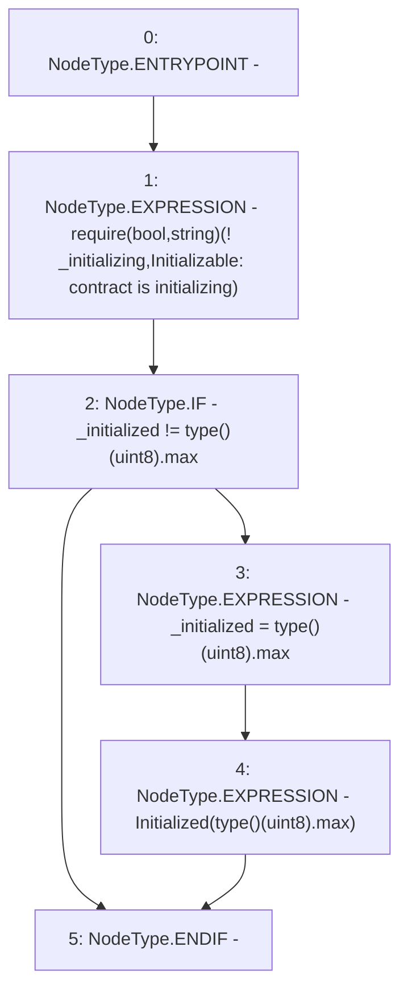

# Context: MochiVault._disableInitializers

**Contract:** `MochiVault` (Inherits: IERC3156FlashLender, IMochiVault, Initializable)
**Signature:** `_disableInitializers()`
**Method Selector ID:** `Internal (No Method ID)`
**Visibility:** `internal`
**Environment-Free:** `Yes`
**Modifiers:** None

### State Variables Interaction
- **Reads:** _initialized, _initializing
- **Writes:** _initialized

### Assertion Checks & Business Requirements
- require/assert: `require(bool,string)(! _initializing,Initializable: contract is initializing)`

### Environment & Verification Flags
- **Uses Foundry Cheatcodes:** No
- **Has Echidna Properties:** No

### Internal Calls Tree
- None

### External Calls / Value Transfers
- None

### Control Flow Graph (CFG)


### Source Mapping
Declared in: `certora-ac-datasets/detasets/web3bugs/dataset/web3bugs/42/projects/mochi-core/node_modules/@openzeppelin/contracts-upgradeable/proxy/utils/Initializable.sol` on lines **145** to **151**

```solidity
    function _disableInitializers() internal virtual {
        require(!_initializing, "Initializable: contract is initializing");
        if (_initialized != type(uint8).max) {
            _initialized = type(uint8).max;
            emit Initialized(type(uint8).max);
        }
    }

```
