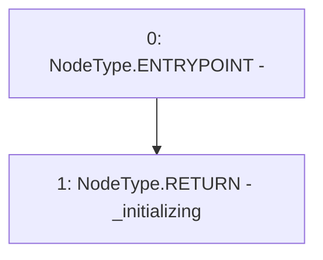

# Context: MochiVault._isInitializing

**Contract:** `MochiVault` (Inherits: IERC3156FlashLender, IMochiVault, Initializable)
**Signature:** `_isInitializing() returns (bool)`
**Method Selector ID:** `Internal (No Method ID)`
**Visibility:** `internal`
**Environment-Free:** `Yes`
**Modifiers:** None

### State Variables Interaction
- **Reads:** _initializing
- **Writes:** None

### Environment & Verification Flags
- **Uses Foundry Cheatcodes:** No
- **Has Echidna Properties:** No

### Internal Calls Tree
- None

### External Calls / Value Transfers
- None

### Control Flow Graph (CFG)


### Source Mapping
Declared in: `certora-ac-datasets/detasets/web3bugs/dataset/web3bugs/42/projects/mochi-core/node_modules/@openzeppelin/contracts-upgradeable/proxy/utils/Initializable.sol` on lines **163** to **165**

```solidity
    function _isInitializing() internal view returns (bool) {
        return _initializing;
    }

```
