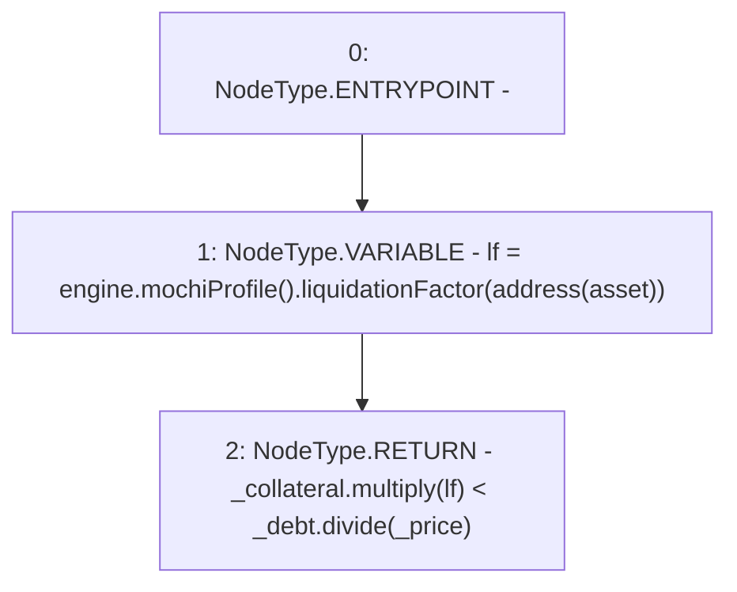

# Context: MochiVault._liquidatable

**Contract:** `MochiVault` (Inherits: IERC3156FlashLender, IMochiVault, Initializable)
**Signature:** `_liquidatable(uint256,float,uint256) returns (bool)`
**Method Selector ID:** `Internal (No Method ID)`
**Visibility:** `internal`
**Environment-Free:** `Yes`
**Modifiers:** None

### State Variables Interaction
- **Reads:** asset, engine
- **Writes:** None

### Environment & Verification Flags
- **Uses Foundry Cheatcodes:** No
- **Has Echidna Properties:** No

### Internal Calls Tree
- None

### External Calls / Value Transfers
- `Float.TMP_183(uint256) = LIBRARY_CALL, dest:Float, function:Float.multiply(uint256,float), arguments:['_collateral', 'lf'] `
- `IMochiProfile.TMP_182(float) = HIGH_LEVEL_CALL, dest:TMP_180(IMochiProfile), function:liquidationFactor, arguments:['TMP_181']  `
- `Float.TMP_184(uint256) = LIBRARY_CALL, dest:Float, function:Float.divide(uint256,float), arguments:['_debt', '_price'] `
- `IMochiEngine.TMP_180(IMochiProfile) = HIGH_LEVEL_CALL, dest:engine(IMochiEngine), function:mochiProfile, arguments:[]  `

### Control Flow Graph (CFG)


### Source Mapping
Declared in: `certora-ac-datasets/detasets/web3bugs/dataset/web3bugs/42/projects/mochi-core/contracts/vault/MochiVault.sol` on lines **300** to **310**

```solidity
    function _liquidatable(
        uint256 _collateral,
        float memory _price,
        uint256 _debt
    ) internal view returns (bool) {
        float memory lf = engine.mochiProfile().liquidationFactor(
            address(asset)
        );
        // when debt is lower than liquidation value, it can be liquidated
        return _collateral.multiply(lf) < _debt.divide(_price);
    }

```
