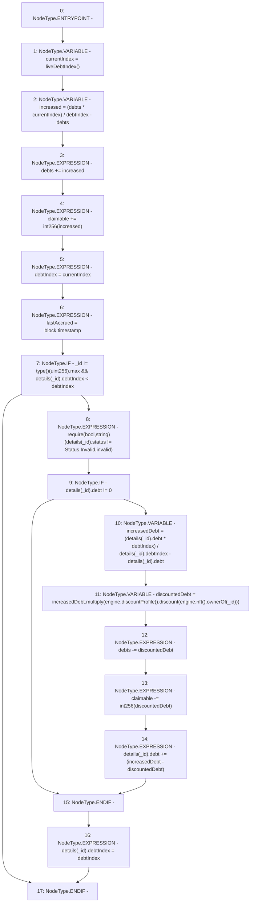

# Context: MochiVault.accrueDebt

**Contract:** `MochiVault` (Inherits: IERC3156FlashLender, IMochiVault, Initializable)
**Signature:** `accrueDebt(uint256)`
**Method Selector ID:** `0x1b13e52f`
**Visibility:** `public`
**Environment-Free:** `No (reads EVM state context)`
**Modifiers:** None

### State Variables Interaction
- **Reads:** claimable, debtIndex, debts, details, engine
- **Writes:** claimable, debtIndex, debts, details, lastAccrued

### Assertion Checks & Business Requirements
- require/assert: `require(bool,string)(details[_id].status != Status.Invalid,invalid)`

### Environment & Verification Flags
- **Uses Foundry Cheatcodes:** No
- **Has Echidna Properties:** No

### Internal Calls Tree
- None

### External Calls / Value Transfers
- `IMochiNFT.TMP_39(address) = HIGH_LEVEL_CALL, dest:TMP_38(IMochiNFT), function:ownerOf, arguments:['_id']  `
- `IMochiEngine.TMP_37(IDiscountProfile) = HIGH_LEVEL_CALL, dest:engine(IMochiEngine), function:discountProfile, arguments:[]  `
- `IMochiEngine.TMP_38(IMochiNFT) = HIGH_LEVEL_CALL, dest:engine(IMochiEngine), function:nft, arguments:[]  `
- `IDiscountProfile.TMP_40(float) = HIGH_LEVEL_CALL, dest:TMP_37(IDiscountProfile), function:discount, arguments:['TMP_39']  `
- `Float.TMP_41(uint256) = LIBRARY_CALL, dest:Float, function:Float.multiply(uint256,float), arguments:['increasedDebt', 'TMP_40'] `

### Control Flow Graph (CFG)


### Source Mapping
Declared in: `certora-ac-datasets/detasets/web3bugs/dataset/web3bugs/42/projects/mochi-core/contracts/vault/MochiVault.sol` on lines **85** to **111**

```solidity
    function accrueDebt(uint256 _id) public {
        // global debt for vault
        // first, increase gloabal debt;
        uint256 currentIndex = liveDebtIndex();
        uint256 increased = (debts * currentIndex) / debtIndex - debts;
        debts += increased;
        claimable += int256(increased);
        // update global debtIndex
        debtIndex = currentIndex;
        lastAccrued = block.timestamp;
        // individual debt
        if (_id != type(uint256).max && details[_id].debtIndex < debtIndex) {
            require(details[_id].status != Status.Invalid, "invalid");
            if (details[_id].debt != 0) {
                uint256 increasedDebt = (details[_id].debt * debtIndex) /
                    details[_id].debtIndex -
                    details[_id].debt;
                uint256 discountedDebt = increasedDebt.multiply(
                    engine.discountProfile().discount(engine.nft().ownerOf(_id))
                );
                debts -= discountedDebt;
                claimable -= int256(discountedDebt);
                details[_id].debt += (increasedDebt - discountedDebt);
            }
            details[_id].debtIndex = debtIndex;
        }
    }

```
