# Context: MochiVault.borrow

**Contract:** `MochiVault` (Inherits: IERC3156FlashLender, IMochiVault, Initializable)
**Signature:** `borrow(uint256,uint256,bytes)`
**Method Selector ID:** `0x3e35fff5`
**Visibility:** `public`
**Environment-Free:** `No (reads EVM state context)`
**Modifiers:**
- `updateDebt`
  ```solidity
  modifier updateDebt(uint256 _id) {
          accrueDebt(_id);
          _;
      }
  ```

### State Variables Interaction
- **Reads:** asset, debts, details, engine
- **Writes:** debts, details

### Assertion Checks & Business Requirements
- require/assert: `require(bool,string)(engine.nft().ownerOf(_id) == msg.sender,!approved)`
- require/assert: `require(bool,string)(engine.nft().asset(_id) == address(asset),!asset)`
- require/assert: `require(bool,string)(details[_id].debt + _amount >= engine.mochiProfile().minimumDebt(),<minimum)`
- require/assert: `require(bool,string)(! _liquidatable(details[_id].collateral,price,totalDebt),!healthy)`

### Environment & Verification Flags
- **Uses Foundry Cheatcodes:** No
- **Has Echidna Properties:** No

### Internal Calls Tree
- None

### External Calls / Value Transfers
- `IMochiEngine.TMP_124(IMochiProfile) = HIGH_LEVEL_CALL, dest:engine(IMochiEngine), function:mochiProfile, arguments:[]  `
- `ICSSRRouter.TMP_106(float) = HIGH_LEVEL_CALL, dest:TMP_104(ICSSRRouter), function:update, arguments:['TMP_105', '_data']  `
- `IMinter.HIGH_LEVEL_CALL, dest:TMP_149(IMinter), function:mint, arguments:['msg.sender', '_amount']  `
- `Float.TMP_111(uint256) = LIBRARY_CALL, dest:Float, function:Float.multiply(uint256,float), arguments:['TMP_110', 'price'] `
- `IMochiEngine.TMP_112(IMochiNFT) = HIGH_LEVEL_CALL, dest:engine(IMochiEngine), function:nft, arguments:[]  `
- `IMochiNFT.TMP_117(address) = HIGH_LEVEL_CALL, dest:TMP_116(IMochiNFT), function:asset, arguments:['_id']  `
- `IMochiEngine.TMP_107(IMochiProfile) = HIGH_LEVEL_CALL, dest:engine(IMochiEngine), function:mochiProfile, arguments:[]  `
- `IMochiProfile.TMP_138(uint256) = HIGH_LEVEL_CALL, dest:TMP_137(IMochiProfile), function:minimumDebt, arguments:[]  `
- `IMochiProfile.TMP_109(float) = HIGH_LEVEL_CALL, dest:TMP_107(IMochiProfile), function:maxCollateralFactor, arguments:['TMP_108']  `
- `IMochiNFT.TMP_113(address) = HIGH_LEVEL_CALL, dest:TMP_112(IMochiNFT), function:ownerOf, arguments:['_id']  `
- `IMochiEngine.TMP_129(IMochiProfile) = HIGH_LEVEL_CALL, dest:engine(IMochiEngine), function:mochiProfile, arguments:[]  `
- `IMochiEngine.TMP_116(IMochiNFT) = HIGH_LEVEL_CALL, dest:engine(IMochiEngine), function:nft, arguments:[]  `
- `IMochiProfile.TMP_131(uint256) = HIGH_LEVEL_CALL, dest:TMP_129(IMochiProfile), function:creditCap, arguments:['TMP_130']  `
- `IMochiEngine.TMP_149(IMinter) = HIGH_LEVEL_CALL, dest:engine(IMochiEngine), function:minter, arguments:[]  `
- `IMochiProfile.TMP_126(uint256) = HIGH_LEVEL_CALL, dest:TMP_124(IMochiProfile), function:creditCap, arguments:['TMP_125']  `
- `IMochiEngine.TMP_104(ICSSRRouter) = HIGH_LEVEL_CALL, dest:engine(IMochiEngine), function:cssr, arguments:[]  `
- `Float.TMP_110(uint256) = LIBRARY_CALL, dest:Float, function:Float.multiply(uint256,float), arguments:['REF_96', 'cf'] `
- `IMochiEngine.TMP_137(IMochiProfile) = HIGH_LEVEL_CALL, dest:engine(IMochiEngine), function:mochiProfile, arguments:[]  `

### Control Flow Graph (CFG)

```mermaid
flowchart TD
    Node_0["0: NodeType.ENTRYPOINT - "]
    Node_0 --> Node_22
    Node_1["1: NodeType.VARIABLE - price = engine.cssr().update(address(asset),_data)"]
    Node_1 --> Node_2
    Node_2["2: NodeType.VARIABLE - cf = engine.mochiProfile().maxCollateralFactor(address(asset))"]
    Node_2 --> Node_3
    Node_3["3: NodeType.VARIABLE - maxMinted = details(_id).collateral.multiply(cf).multiply(price)"]
    Node_3 --> Node_4
    Node_4["4: NodeType.EXPRESSION - require(bool,string)(engine.nft().ownerOf(_id) == msg.sender,!approved)"]
    Node_4 --> Node_5
    Node_5["5: NodeType.EXPRESSION - require(bool,string)(engine.nft().asset(_id) == address(asset),!asset)"]
    Node_5 --> Node_6
    Node_6["6: NodeType.IF - details(_id).debt + _amount > maxMinted"]
    Node_6 --> Node_7
    Node_6 --> Node_8
    Node_7["7: NodeType.EXPRESSION - _amount = maxMinted - details(_id).debt"]
    Node_7 --> Node_8
    Node_8["8: NodeType.ENDIF - "]
    Node_8 --> Node_9
    Node_9["9: NodeType.IF - engine.mochiProfile().creditCap(address(asset)) < debts + _amount"]
    Node_9 --> Node_10
    Node_9 --> Node_11
    Node_10["10: NodeType.EXPRESSION - _amount = engine.mochiProfile().creditCap(address(asset)) - debts"]
    Node_10 --> Node_11
    Node_11["11: NodeType.ENDIF - "]
    Node_11 --> Node_12
    Node_12["12: NodeType.VARIABLE - increasingDebt = (_amount * 1005) / 1000"]
    Node_12 --> Node_13
    Node_13["13: NodeType.VARIABLE - totalDebt = details(_id).debt + increasingDebt"]
    Node_13 --> Node_14
    Node_14["14: NodeType.EXPRESSION - require(bool,string)(details(_id).debt + _amount >= engine.mochiProfile().minimumDebt(),<minimum)"]
    Node_14 --> Node_15
    Node_15["15: NodeType.EXPRESSION - require(bool,string)(! _liquidatable(details(_id).collateral,price,totalDebt),!healthy)"]
    Node_15 --> Node_16
    Node_16["16: NodeType.EXPRESSION - mintFeeToPool(increasingDebt - _amount,details(_id).referrer)"]
    Node_16 --> Node_17
    Node_17["17: NodeType.EXPRESSION - details(_id).debtIndex = (details(_id).debtIndex * (totalDebt)) / (details(_id).debt + _amount)"]
    Node_17 --> Node_18
    Node_18["18: NodeType.EXPRESSION - details(_id).debt = totalDebt"]
    Node_18 --> Node_19
    Node_19["19: NodeType.EXPRESSION - details(_id).status = Status.Active"]
    Node_19 --> Node_20
    Node_20["20: NodeType.EXPRESSION - debts += _amount"]
    Node_20 --> Node_21
    Node_21["21: NodeType.EXPRESSION - engine.minter().mint(msg.sender,_amount)"]
    Node_22["22: NodeType.EXPRESSION - updateDebt(_id)"]
    Node_22 --> Node_1
```


### Source Mapping
Declared in: `certora-ac-datasets/detasets/web3bugs/dataset/web3bugs/42/projects/mochi-core/contracts/vault/MochiVault.sol` on lines **213** to **250**

```solidity
    function borrow(
        uint256 _id,
        uint256 _amount,
        bytes memory _data
    ) public override updateDebt(_id) {
        // update prior to interaction
        float memory price = engine.cssr().update(address(asset), _data);
        float memory cf = engine.mochiProfile().maxCollateralFactor(
            address(asset)
        );
        uint256 maxMinted = details[_id].collateral.multiply(cf).multiply(
            price
        );
        require(engine.nft().ownerOf(_id) == msg.sender, "!approved");
        require(engine.nft().asset(_id) == address(asset), "!asset");
        if(details[_id].debt + _amount > maxMinted) {
            _amount = maxMinted - details[_id].debt;
        }
        if(engine.mochiProfile().creditCap(address(asset)) < debts + _amount) {
            _amount = engine.mochiProfile().creditCap(address(asset)) - debts;
        }
        uint256 increasingDebt = (_amount * 1005) / 1000;
        uint256 totalDebt = details[_id].debt + increasingDebt;
        require(details[_id].debt + _amount >= engine.mochiProfile().minimumDebt(), "<minimum");
        require(
            !_liquidatable(details[_id].collateral, price, totalDebt),
            "!healthy"
        );
        mintFeeToPool(increasingDebt - _amount, details[_id].referrer);
        // this will ensure debtIndex will not increase on further `updateDebt` triggers
        details[_id].debtIndex =
            (details[_id].debtIndex * (totalDebt)) /
            (details[_id].debt + _amount);
        details[_id].debt = totalDebt;
        details[_id].status = Status.Active;
        debts += _amount;
        engine.minter().mint(msg.sender, _amount);
    }

```
