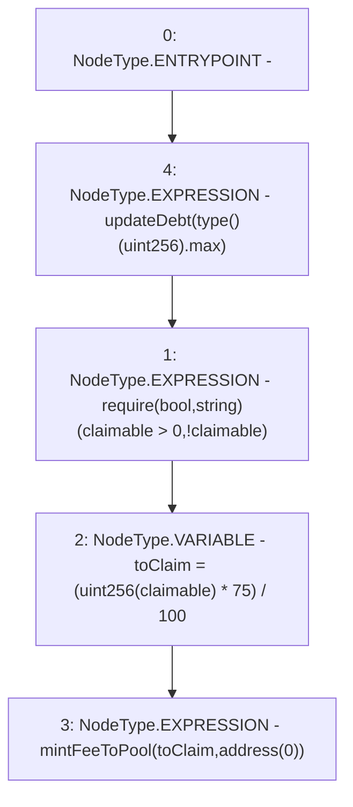

# Context: MochiVault.claim

**Contract:** `MochiVault` (Inherits: IERC3156FlashLender, IMochiVault, Initializable)
**Signature:** `claim()`
**Method Selector ID:** `0x4e71d92d`
**Visibility:** `external`
**Environment-Free:** `No (reads EVM state context)`
**Modifiers:**
- `updateDebt`
  ```solidity
  modifier updateDebt(uint256 _id) {
          accrueDebt(_id);
          _;
      }
  ```

### State Variables Interaction
- **Reads:** claimable
- **Writes:** None

### Assertion Checks & Business Requirements
- require/assert: `require(bool,string)(claimable > 0,!claimable)`

### Environment & Verification Flags
- **Uses Foundry Cheatcodes:** No
- **Has Echidna Properties:** No

### Internal Calls Tree
- None

### External Calls / Value Transfers
- None

### Control Flow Graph (CFG)


### Source Mapping
Declared in: `certora-ac-datasets/detasets/web3bugs/dataset/web3bugs/42/projects/mochi-core/contracts/vault/MochiVault.sol` on lines **317** to **322**

```solidity
    function claim() external updateDebt(type(uint256).max) {
        require(claimable > 0, "!claimable");
        // reserving 25% to prevent potential risks
        uint256 toClaim = (uint256(claimable) * 75) / 100;
        mintFeeToPool(toClaim, address(0));
    }

```
