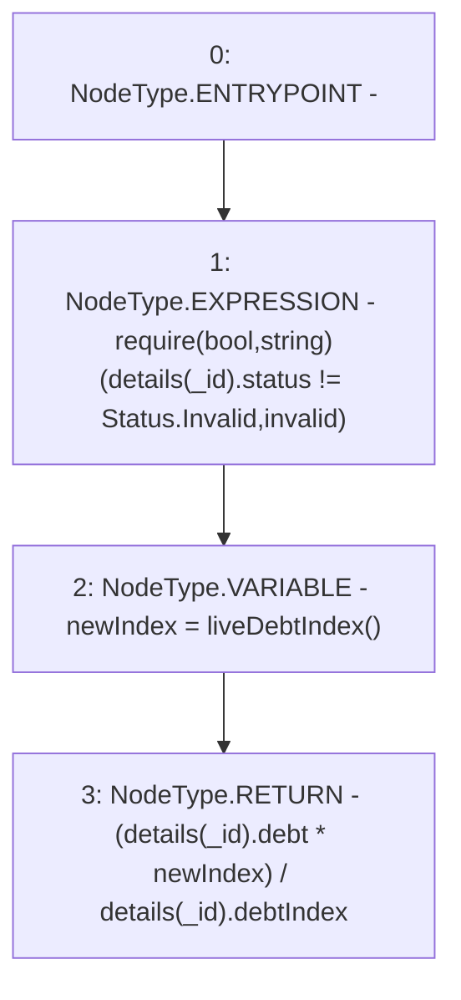

# Context: MochiVault.currentDebt

**Contract:** `MochiVault` (Inherits: IERC3156FlashLender, IMochiVault, Initializable)
**Signature:** `currentDebt(uint256) returns (uint256)`
**Method Selector ID:** `0xbcb29667`
**Visibility:** `public`
**Environment-Free:** `Yes`
**Modifiers:** None

### State Variables Interaction
- **Reads:** details
- **Writes:** None

### Assertion Checks & Business Requirements
- require/assert: `require(bool,string)(details[_id].status != Status.Invalid,invalid)`

### Environment & Verification Flags
- **Uses Foundry Cheatcodes:** No
- **Has Echidna Properties:** No

### Internal Calls Tree
- None

### External Calls / Value Transfers
- None

### Control Flow Graph (CFG)


### Source Mapping
Declared in: `certora-ac-datasets/detasets/web3bugs/dataset/web3bugs/42/projects/mochi-core/contracts/vault/MochiVault.sol` on lines **79** to **83**

```solidity
    function currentDebt(uint256 _id) public view override returns (uint256) {
        require(details[_id].status != Status.Invalid, "invalid");
        uint256 newIndex = liveDebtIndex();
        return (details[_id].debt * newIndex) / details[_id].debtIndex;
    }

```
