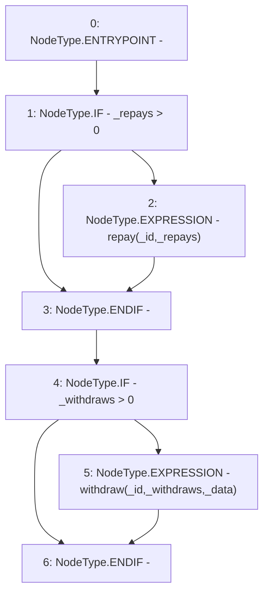

# Context: MochiVault.decrease

**Contract:** `MochiVault` (Inherits: IERC3156FlashLender, IMochiVault, Initializable)
**Signature:** `decrease(uint256,uint256,uint256,bytes)`
**Method Selector ID:** `0xb3363bb1`
**Visibility:** `external`
**Environment-Free:** `No (reads EVM state context)`
**Modifiers:** None

### State Variables Interaction
- **Reads:** None
- **Writes:** None

### Environment & Verification Flags
- **Uses Foundry Cheatcodes:** No
- **Has Echidna Properties:** No

### Internal Calls Tree
- None

### External Calls / Value Transfers
- None

### Control Flow Graph (CFG)


### Source Mapping
Declared in: `certora-ac-datasets/detasets/web3bugs/dataset/web3bugs/42/projects/mochi-core/contracts/vault/MochiVault.sol` on lines **132** to **144**

```solidity
    function decrease(
        uint256 _id,
        uint256 _withdraws,
        uint256 _repays,
        bytes memory _data
    ) external {
        if (_repays > 0) {
            repay(_id, _repays);
        }
        if (_withdraws > 0) {
            withdraw(_id, _withdraws, _data);
        }
    }

```
