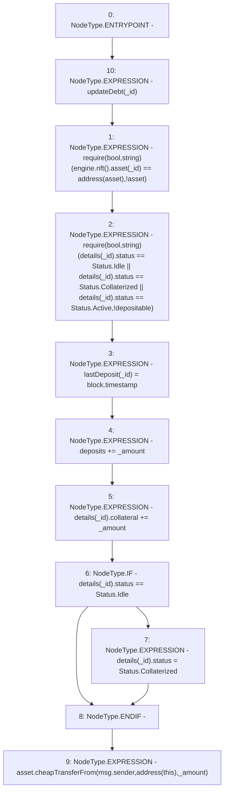

# Context: MochiVault.deposit

**Contract:** `MochiVault` (Inherits: IERC3156FlashLender, IMochiVault, Initializable)
**Signature:** `deposit(uint256,uint256)`
**Method Selector ID:** `0xe2bbb158`
**Visibility:** `public`
**Environment-Free:** `No (reads EVM state context)`
**Modifiers:**
- `updateDebt`
  ```solidity
  modifier updateDebt(uint256 _id) {
          accrueDebt(_id);
          _;
      }
  ```

### State Variables Interaction
- **Reads:** asset, deposits, details, engine
- **Writes:** deposits, details, lastDeposit

### Assertion Checks & Business Requirements
- require/assert: `require(bool,string)(engine.nft().asset(_id) == address(asset),!asset)`
- require/assert: `require(bool,string)(details[_id].status == Status.Idle || details[_id].status == Status.Collaterized || details[_id].status == Status.Active,!depositable)`

### Environment & Verification Flags
- **Uses Foundry Cheatcodes:** No
- **Has Echidna Properties:** No

### Internal Calls Tree
- None

### External Calls / Value Transfers
- `IMochiNFT.TMP_61(address) = HIGH_LEVEL_CALL, dest:TMP_60(IMochiNFT), function:asset, arguments:['_id']  `
- `CheapERC20.LIBRARY_CALL, dest:CheapERC20, function:CheapERC20.cheapTransferFrom(IERC20,address,address,uint256), arguments:['asset', 'msg.sender', 'TMP_72', '_amount'] `
- `IMochiEngine.TMP_60(IMochiNFT) = HIGH_LEVEL_CALL, dest:engine(IMochiEngine), function:nft, arguments:[]  `

### Control Flow Graph (CFG)


### Source Mapping
Declared in: `certora-ac-datasets/detasets/web3bugs/dataset/web3bugs/42/projects/mochi-core/contracts/vault/MochiVault.sol` on lines **158** to **178**

```solidity
    function deposit(uint256 _id, uint256 _amount)
        public
        override
        updateDebt(_id)
    {
        // should it be able to deposit if invalid?
        require(engine.nft().asset(_id) == address(asset), "!asset");
        require(
            details[_id].status == Status.Idle ||
                details[_id].status == Status.Collaterized ||
                details[_id].status == Status.Active,
            "!depositable"
        );
        lastDeposit[_id] = block.timestamp;
        deposits += _amount;
        details[_id].collateral += _amount;
        if (details[_id].status == Status.Idle) {
            details[_id].status = Status.Collaterized;
        }
        asset.cheapTransferFrom(msg.sender, address(this), _amount);
    }

```
