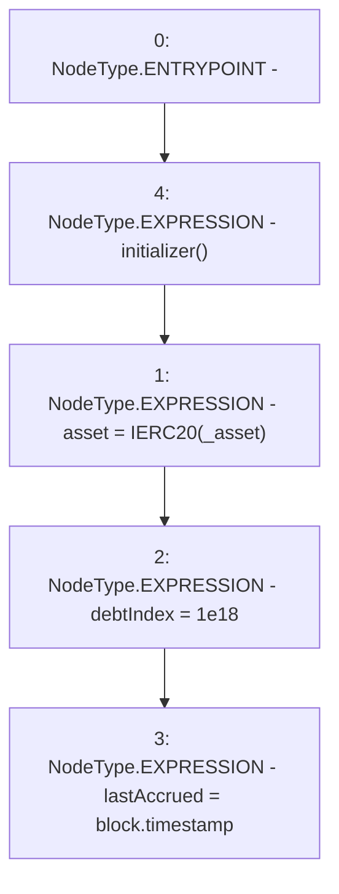

# Context: MochiVault.initialize

**Contract:** `MochiVault` (Inherits: IERC3156FlashLender, IMochiVault, Initializable)
**Signature:** `initialize(address)`
**Method Selector ID:** `0xc4d66de8`
**Visibility:** `external`
**Environment-Free:** `No (reads EVM state context)`
**Modifiers:**
- `initializer`
  ```solidity
  modifier initializer() {
          bool isTopLevelCall = !_initializing;
          require(
              (isTopLevelCall && _initialized < 1) || (!AddressUpgradeable.isContract(address(this)) && _initialized == 1),
              "Initializable: contract is already initialized"
          );
          _initialized = 1;
          if (isTopLevelCall) {
              _initializing = true;
          }
          _;
          if (isTopLevelCall) {
              _initializing = false;
              emit Initialized(1);
          }
      }
  ```

### State Variables Interaction
- **Reads:** None
- **Writes:** asset, debtIndex, lastAccrued

### Environment & Verification Flags
- **Uses Foundry Cheatcodes:** No
- **Has Echidna Properties:** No

### Internal Calls Tree
- None

### External Calls / Value Transfers
- None

### Control Flow Graph (CFG)


### Source Mapping
Declared in: `certora-ac-datasets/detasets/web3bugs/dataset/web3bugs/42/projects/mochi-core/contracts/vault/MochiVault.sol` on lines **60** to **64**

```solidity
    function initialize(address _asset) external override initializer {
        asset = IERC20(_asset);
        debtIndex = 1e18;
        lastAccrued = block.timestamp;
    }

```
