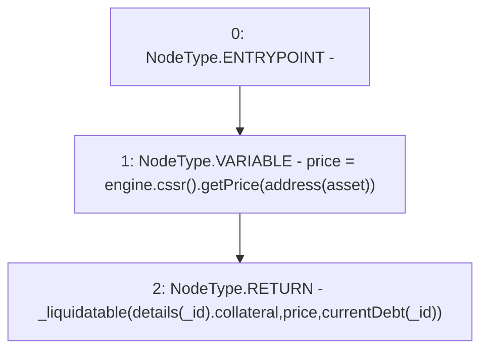

# Context: MochiVault.liquidatable

**Contract:** `MochiVault` (Inherits: IERC3156FlashLender, IMochiVault, Initializable)
**Signature:** `liquidatable(uint256) returns (bool)`
**Method Selector ID:** `0x7d751896`
**Visibility:** `external`
**Environment-Free:** `Yes`
**Modifiers:** None

### State Variables Interaction
- **Reads:** asset, details, engine
- **Writes:** None

### Environment & Verification Flags
- **Uses Foundry Cheatcodes:** No
- **Has Echidna Properties:** No

### Internal Calls Tree
- None

### External Calls / Value Transfers
- `ICSSRRouter.TMP_188(float) = HIGH_LEVEL_CALL, dest:TMP_186(ICSSRRouter), function:getPrice, arguments:['TMP_187']  `
- `IMochiEngine.TMP_186(ICSSRRouter) = HIGH_LEVEL_CALL, dest:engine(IMochiEngine), function:cssr, arguments:[]  `

### Control Flow Graph (CFG)


### Source Mapping
Declared in: `certora-ac-datasets/detasets/web3bugs/dataset/web3bugs/42/projects/mochi-core/contracts/vault/MochiVault.sol` on lines **312** to **315**

```solidity
    function liquidatable(uint256 _id) external view returns (bool) {
        float memory price = engine.cssr().getPrice(address(asset));
        return _liquidatable(details[_id].collateral, price, currentDebt(_id));
    }

```
