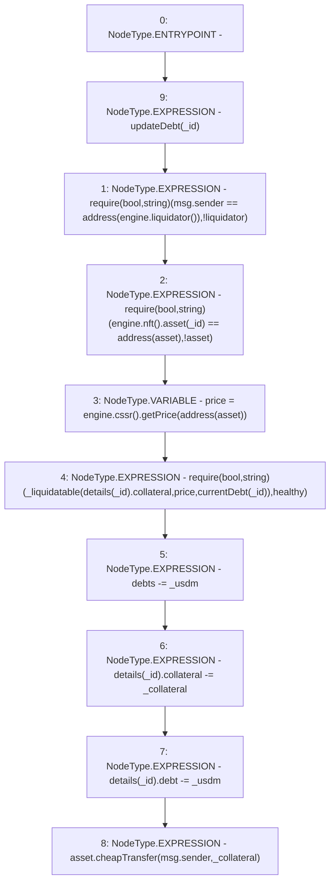

# Context: MochiVault.liquidate

**Contract:** `MochiVault` (Inherits: IERC3156FlashLender, IMochiVault, Initializable)
**Signature:** `liquidate(uint256,uint256,uint256)`
**Method Selector ID:** `0x20dc2088`
**Visibility:** `external`
**Environment-Free:** `No (reads EVM state context)`
**Modifiers:**
- `updateDebt`
  ```solidity
  modifier updateDebt(uint256 _id) {
          accrueDebt(_id);
          _;
      }
  ```

### State Variables Interaction
- **Reads:** asset, debts, details, engine
- **Writes:** debts, details

### Assertion Checks & Business Requirements
- require/assert: `require(bool,string)(msg.sender == address(engine.liquidator()),!liquidator)`
- require/assert: `require(bool,string)(engine.nft().asset(_id) == address(asset),!asset)`
- require/assert: `require(bool,string)(_liquidatable(details[_id].collateral,price,currentDebt(_id)),healthy)`

### Environment & Verification Flags
- **Uses Foundry Cheatcodes:** No
- **Has Echidna Properties:** No

### Internal Calls Tree
- None

### External Calls / Value Transfers
- `ICSSRRouter.TMP_174(float) = HIGH_LEVEL_CALL, dest:TMP_172(ICSSRRouter), function:getPrice, arguments:['TMP_173']  `
- `IMochiNFT.TMP_168(address) = HIGH_LEVEL_CALL, dest:TMP_167(IMochiNFT), function:asset, arguments:['_id']  `
- `CheapERC20.LIBRARY_CALL, dest:CheapERC20, function:CheapERC20.cheapTransfer(IERC20,address,uint256), arguments:['asset', 'msg.sender', '_collateral'] `
- `IMochiEngine.TMP_163(ILiquidator) = HIGH_LEVEL_CALL, dest:engine(IMochiEngine), function:liquidator, arguments:[]  `
- `IMochiEngine.TMP_172(ICSSRRouter) = HIGH_LEVEL_CALL, dest:engine(IMochiEngine), function:cssr, arguments:[]  `
- `IMochiEngine.TMP_167(IMochiNFT) = HIGH_LEVEL_CALL, dest:engine(IMochiEngine), function:nft, arguments:[]  `

### Control Flow Graph (CFG)


### Source Mapping
Declared in: `certora-ac-datasets/detasets/web3bugs/dataset/web3bugs/42/projects/mochi-core/contracts/vault/MochiVault.sol` on lines **277** to **296**

```solidity
    function liquidate(
        uint256 _id,
        uint256 _collateral,
        uint256 _usdm
    ) external override updateDebt(_id) {
        require(msg.sender == address(engine.liquidator()), "!liquidator");
        require(engine.nft().asset(_id) == address(asset), "!asset");
        float memory price = engine.cssr().getPrice(address(asset));
        require(
            _liquidatable(details[_id].collateral, price, currentDebt(_id)),
            "healthy"
        );

        debts -= _usdm;

        details[_id].collateral -= _collateral;
        details[_id].debt -= _usdm;

        asset.cheapTransfer(msg.sender, _collateral);
    }

```
