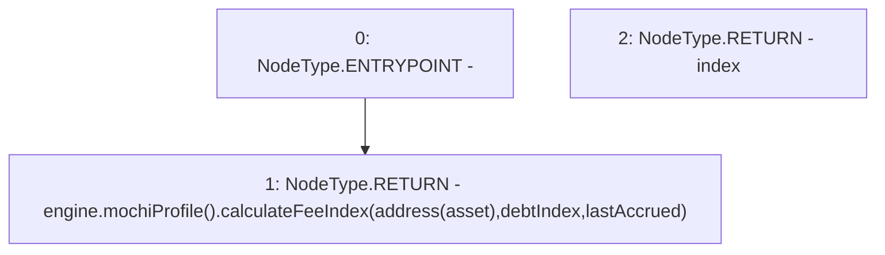

# Context: MochiVault.liveDebtIndex

**Contract:** `MochiVault` (Inherits: IERC3156FlashLender, IMochiVault, Initializable)
**Signature:** `liveDebtIndex() returns (uint256)`
**Method Selector ID:** `0x80b3540a`
**Visibility:** `public`
**Environment-Free:** `Yes`
**Modifiers:** None

### State Variables Interaction
- **Reads:** asset, debtIndex, engine, lastAccrued
- **Writes:** None

### Environment & Verification Flags
- **Uses Foundry Cheatcodes:** No
- **Has Echidna Properties:** No

### Internal Calls Tree
- None

### External Calls / Value Transfers
- `IMochiProfile.TMP_15(uint256) = HIGH_LEVEL_CALL, dest:TMP_13(IMochiProfile), function:calculateFeeIndex, arguments:['TMP_14', 'debtIndex', 'lastAccrued']  `
- `IMochiEngine.TMP_13(IMochiProfile) = HIGH_LEVEL_CALL, dest:engine(IMochiEngine), function:mochiProfile, arguments:[]  `

### Control Flow Graph (CFG)


### Source Mapping
Declared in: `certora-ac-datasets/detasets/web3bugs/dataset/web3bugs/42/projects/mochi-core/contracts/vault/MochiVault.sol` on lines **66** to **73**

```solidity
    function liveDebtIndex() public view override returns (uint256 index) {
        return
            engine.mochiProfile().calculateFeeIndex(
                address(asset),
                debtIndex,
                lastAccrued
            );
    }

```
