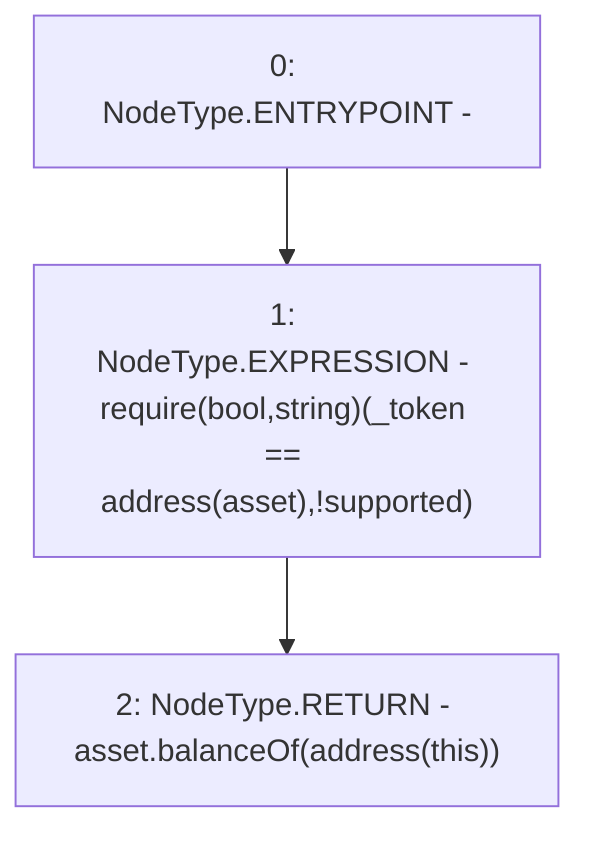

# Context: MochiVault.maxFlashLoan

**Contract:** `MochiVault` (Inherits: IERC3156FlashLender, IMochiVault, Initializable)
**Signature:** `maxFlashLoan(address) returns (uint256)`
**Method Selector ID:** `0x613255ab`
**Visibility:** `external`
**Environment-Free:** `Yes`
**Modifiers:** None

### State Variables Interaction
- **Reads:** asset
- **Writes:** None

### Assertion Checks & Business Requirements
- require/assert: `require(bool,string)(_token == address(asset),!supported)`

### Environment & Verification Flags
- **Uses Foundry Cheatcodes:** No
- **Has Echidna Properties:** No

### Internal Calls Tree
- None

### External Calls / Value Transfers
- `IERC20.TMP_218(uint256) = HIGH_LEVEL_CALL, dest:asset(IERC20), function:balanceOf, arguments:['TMP_217']  `

### Control Flow Graph (CFG)


### Source Mapping
Declared in: `certora-ac-datasets/detasets/web3bugs/dataset/web3bugs/42/projects/mochi-core/contracts/vault/MochiVault.sol` on lines **335** to **343**

```solidity
    function maxFlashLoan(address _token)
        external
        view
        override
        returns (uint256)
    {
        require(_token == address(asset), "!supported");
        return asset.balanceOf(address(this));
    }

```
