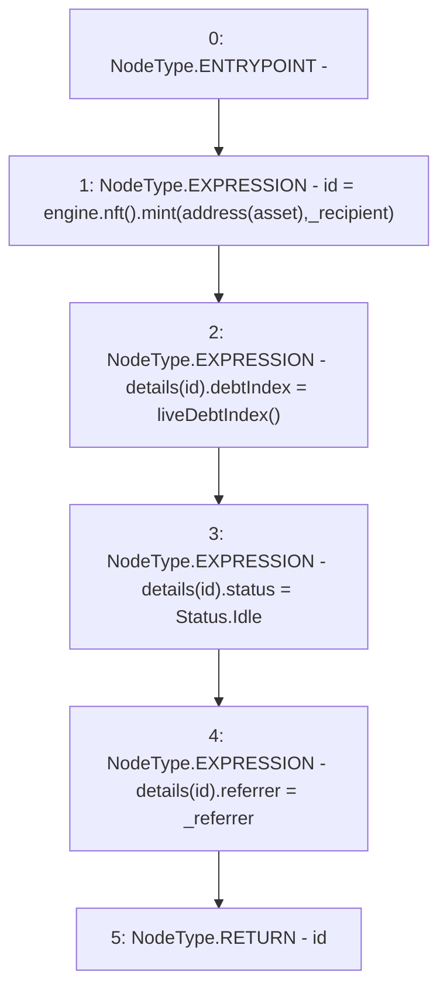

# Context: MochiVault.mint

**Contract:** `MochiVault` (Inherits: IERC3156FlashLender, IMochiVault, Initializable)
**Signature:** `mint(address,address) returns (uint256)`
**Method Selector ID:** `0xee1fe2ad`
**Visibility:** `public`
**Environment-Free:** `Yes`
**Modifiers:** None

### State Variables Interaction
- **Reads:** asset, details, engine
- **Writes:** details

### Environment & Verification Flags
- **Uses Foundry Cheatcodes:** No
- **Has Echidna Properties:** No

### Internal Calls Tree
- None

### External Calls / Value Transfers
- `IMochiNFT.TMP_58(uint256) = HIGH_LEVEL_CALL, dest:TMP_56(IMochiNFT), function:mint, arguments:['TMP_57', '_recipient']  `
- `IMochiEngine.TMP_56(IMochiNFT) = HIGH_LEVEL_CALL, dest:engine(IMochiEngine), function:nft, arguments:[]  `

### Control Flow Graph (CFG)


### Source Mapping
Declared in: `certora-ac-datasets/detasets/web3bugs/dataset/web3bugs/42/projects/mochi-core/contracts/vault/MochiVault.sol` on lines **146** to **154**

```solidity
    function mint(address _recipient, address _referrer)
        public
        returns (uint256 id)
    {
        id = engine.nft().mint(address(asset), _recipient);
        details[id].debtIndex = liveDebtIndex();
        details[id].status = Status.Idle;
        details[id].referrer = _referrer;
    }

```
